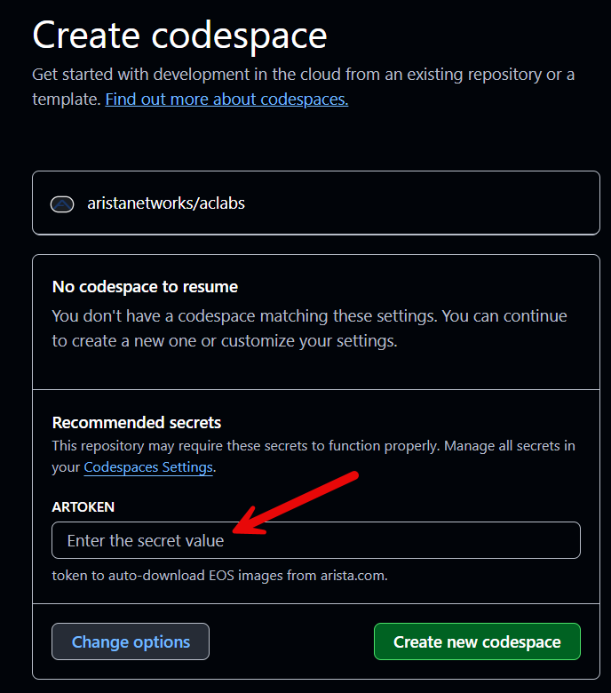

# Getting started with Arista Community Labs

This guide is intended for individuals looking to familiarize themselves with the steps necessary to get started with Arista Community Labs, powered by [GitHub Codespaces](https://github.com/features/codespaces/).

## Pre-Requisites

Before launching an Arista Community Lab, we need to ensure we have the following:

1. [Arista](https://www.arista.com) account with the ability to download cEOS-lab via [Software Downloads](https://www.arista.com/en/support/software-download)
2. [GitHub account](https://github.com/signup)
3. [Arista user token](https://www.arista.com/en/users/profile)

We can find the user token by logging into [arista.com](https://www.arista.com) and selecting `My Profile`.

The tabs below illustrate the steps needed to locate and copy the token:

=== "Login"
    <figure markdown>
    { width=700px }
    <figcaption>Arista - Login</figcaption>
    </figure>

=== "My Profile"
    <figure markdown>
    { width=700px }
    <figcaption>Arista - My Profile</figcaption>
    </figure>

=== "User Token"
    <figure markdown>
    { width=700px }
    <figcaption>Arista - User Token (Blurred) </figcaption>
    </figure>

??? question "What's with the token? :coin:"
    When an Arista Community Lab is started, the user token will be used to automatically download and import the necesary cEOS-lab image into the lab environment

## Starting the Lab

!!! note
    Throughout this guide, the [EVPN Domain A](https://codespaces.new/aristanetworks/aclabs/tree/main?quickstart=1&devcontainer_path=.devcontainer%2Ftechlib-vxlan-domain-a%2Fdevcontainer.json) lab associated with the [EVPN/VXLAN Deployment Guide](https://tech-library.arista.com/data_center/evpnvxlan/deployment_guide/) on [Arista's Tech Library](https://tech-library.arista.com) will be used as a reference point. All community labs hosted via Codespaces will follow the same process.

Once a lab has been launched via it's respective 'Start Lab' button, a `Create Codespace` window will be opened via a web browser:

<figure markdown>
{ width=500px }
<figcaption> Create a Codespace - Enter our user token </figcaption>
</figure>

In the `ARTOKEN` field, paste the user token copied from the arista.com user profile. This is a one time requirement, and will be saved for all subsequent Arista Community Lab deployments.

??? question "Where is the token saved? :thinking:"
    Once entered, the token is saved as a GitHub Codespaces `Secret`. This can be viewed via the [Codespaces section of GitHub account settings](https://github.com/settings/codespaces).

??? note "Watch the expiration date! :hourglass_flowing_sand:"
    User tokens on arista.com have an expiration date associated with them, listed in the `Token Valid Till` field in the `Portal Access` section of the user profile.

    If the token has expired, simply click `Regenerate Token` to create a new one. A token expires one year after it was generated; This value cannot be modified by the user.

Once the token has been entered, and `Create new Codespace` has been selected, a new tab will open in the browser containing the codespace

??? question "Wait...the codespace opened in my local VS Code!"
    Not a problem - this just means that VS Code is locally installed and `Visual Studio Code` is selected in the `Editor preference` section of the [GitHub account's Codespaces settings](https://github.com/settings/codespaces).

In the newly launched Codespace, a tab is opened displaying an overview of the lab.

The `Post Deploy Script` can be seen running in the terminal, and will take a few minutes to complete.

<figure markdown>
{ width=800px }
<figcaption>Post Deploy Script Running (Click to Zoom)</figcaption>
</figure>

!!! note "Grab a coffee! :coffee:"
    The post deployment script can take a few minutes to run. Grab a coffee while the lab environment is being created.

Once the post deployment script has completed, the terminal prompt will change to the GitHub username followed by the name of the lab.

In the screenshot below, the GitHub username is `MitchV85` and the lab is `techlib-vxlan-domain-a`.

<figure markdown>
{ width=800px }
<figcaption>Post Deploy Script Complete (Click to Zoom)</figcaption>
</figure>

At this point, the lab is ready to go! Running the following command in the terminal will provide an overview and status of all deployed nodes:

```bash
make inspect
```

<figure markdown>
{ width=800px }
<figcaption>Lab Status Output (Click to Zoom)</figcaption>
</figure>

## Interacting with the Lab

### SSH

Once the lab is up and running, we can use the terminal in our Codespace to SSH into the nodes.

??? tip "More real estate for those SSH sessions 🏠"
    Increase the size of the terminal by selecting the `Maximize Panel Size` button to the right of the terminal:

    <figure markdown>
    { width=800px }
    <figcaption>Maximize the Terminal (Click to Zoom)</figcaption>
    </figure>

??? tip "Use tabs 📑"
    Create a new tab for an SSH session by selecting `New Terminal` to the right of the terminal.

    Alternatively, the following keyboard shortcut can be used to open a new tab on both Windows and macOS: ++ctrl+shift+single-quote++

    Once opened, the new terminal tab can be renamed by right-clicking on the tab and selecting `Rename`

    === "New Terminal"
        <figure markdown>
        { width=800px }
        <figcaption>New Terminal Tab (Click to Zoom)</figcaption>
        </figure>

    === "Rename the Tab"
        <figure markdown>
        { width=800px }
        <figcaption>Rename the Terminal Tab (Click to Zoom)</figcaption>
        </figure>

    === "Party Time 🎉"
        <figure markdown>
        { width=800px }
        <figcaption>Rename the Terminal Tab (Click to Zoom)</figcaption>
        </figure>

A list of `Lab Hosts` that are accessible via `SSH` from within the codespace can be viewed at any time from the terminal by entering the following command:

```bash
make inspect
```

To access a node, use the `ssh` command followed by `admin@hostname` as shown in the example below

```bash
ssh admin@A-SPINE1
```

!!! question "What's the password? :lock:"
    Unless stated otherwise, the default username of `admin` and password of `admin` is used for all nodes in an Arista Community lab

### API

All nodes are accessible via API from within the codespace. The codespace comes pre-packaged with tools such as Python and the Arista [AVD](https://galaxy.ansible.com/ui/repo/published/arista/avd/), [CVP](https://galaxy.ansible.com/ui/repo/published/arista/cvp/), and [EOS](https://galaxy.ansible.com/ui/repo/published/arista/eos/) Ansible Galaxy collections.

## Stopping the Lab

When finished with the lab, simply close the codespace by exiting the browser window. By default, a GitHub Codespace will be stopped after being idle for 45 minutes and deleted after 30 days of inactivity.

!!! question "What if I forget about my lab? :scream:"
    The `Default idle timeout` and `Default retention period` values can be modified under our [GitHub account's Codespaces settings](https://github.com/settings/codespaces).

A list of all codespaces can be found in the [Codespaces section of GitHub](https://github.com/codespaces). From here, a codespace can be resumed, stopped, deleted, renamed, and more!

:test_tube: Happy labbing! :test_tube:
