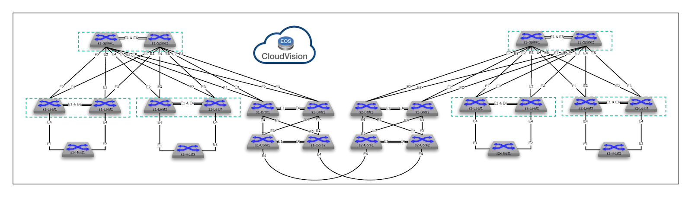

# ATD Dual DC

!!! Info "Lab Details"

    :fontawesome-solid-tag: **AVD Version:** 5.7.2 
    :fontawesome-solid-network-wired: **cEOS-lab:** 4.34.2F 
    :fontawesome-solid-flask: **Containerlab:** 0.71.1 

    

## How To Run The Lab

Arista Community Lab runs in a cloud-based lab environment sponsored by Arista [^1]. To get started, sign in at [labs.arista.com](https://labs.arista.com/) and click the button below to launch the lab.

[Start the lab :octicons-play-16:](https://labs.arista.com/launch?lab_type=atd-atd-dual-dc&origin=tech-lib){ .md-button .md-button--primary target=_blank}

All lab files are also available for [download](https://{{gh.org_name}}.github.io/{{gh.repo_name}}/lab_archives/atd-atd-dual-dc.tar.gz) if you want to run the lab on your own machine :material-information-outline:{ title="When deploying on ARM host - use cEOS-lab ARM image!" }. This option is intended for experienced users who can manage the environment without extra support.

## Lab Inventory

This lab has the following devices:

| Hostname | Type | OS | Management Address | Username | Password |
| -------- | ---- | -- | ------------------ | -------- | -------- |
| s1-spine1 | switch | cEOS-lab, 4.34.2F | 192.168.0.10 | arista | arista |
| s1-spine2 | switch | cEOS-lab, 4.34.2F | 192.168.0.11 | arista | arista |
| s1-leaf1 | switch | cEOS-lab, 4.34.2F | 192.168.0.12 | arista | arista |
| s1-leaf2 | switch | cEOS-lab, 4.34.2F | 192.168.0.13 | arista | arista |
| s1-leaf3 | switch | cEOS-lab, 4.34.2F | 192.168.0.14 | arista | arista |
| s1-leaf4 | switch | cEOS-lab, 4.34.2F | 192.168.0.15 | arista | arista |
| s1-brdr1 | switch | cEOS-lab, 4.34.2F | 192.168.0.100 | arista | arista |
| s1-brdr2 | switch | cEOS-lab, 4.34.2F | 192.168.0.101 | arista | arista |
| s1-core1 | switch | cEOS-lab, 4.34.2F | 192.168.0.102 | arista | arista |
| s1-core2 | switch | cEOS-lab, 4.34.2F | 192.168.0.103 | arista | arista |
| s2-spine1 | switch | cEOS-lab, 4.34.2F | 192.168.0.20 | arista | arista |
| s2-spine2 | switch | cEOS-lab, 4.34.2F | 192.168.0.21 | arista | arista |
| s2-leaf1 | switch | cEOS-lab, 4.34.2F | 192.168.0.22 | arista | arista |
| s2-leaf2 | switch | cEOS-lab, 4.34.2F | 192.168.0.23 | arista | arista |
| s2-leaf3 | switch | cEOS-lab, 4.34.2F | 192.168.0.24 | arista | arista |
| s2-leaf4 | switch | cEOS-lab, 4.34.2F | 192.168.0.25 | arista | arista |
| s2-brdr1 | switch | cEOS-lab, 4.34.2F | 192.168.0.200 | arista | arista |
| s2-brdr2 | switch | cEOS-lab, 4.34.2F | 192.168.0.201 | arista | arista |
| s2-core1 | switch | cEOS-lab, 4.34.2F | 192.168.0.202 | arista | arista |
| s2-core2 | switch | cEOS-lab, 4.34.2F | 192.168.0.203 | arista | arista |
| s1-host1 | host | cEOS-lab, 4.34.2F | 192.168.0.16 | arista | arista |
| s1-host2 | host | cEOS-lab, 4.34.2F | 192.168.0.17 | arista | arista |
| s2-host1 | host | cEOS-lab, 4.34.2F | 192.168.0.26 | arista | arista |
| s2-host2 | host | cEOS-lab, 4.34.2F | 192.168.0.27 | arista | arista |

> To access any device, use `ssh <username>@<hostname>` or simply type `<hostname>` to use the SSH alias.

## Last Updated

!!! Info "Last reviewed: 21/05/2026"

    Demos and labs reviewed more than 6 months ago may be outdated.

[^1]: GitHub Codespaces support was removed due to platform restrictions. Use labs.arista.com instead; it is available to all users with an arista.com account.
