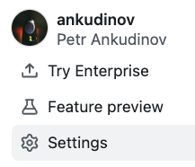
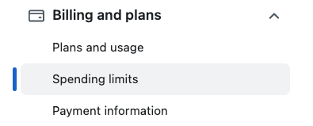
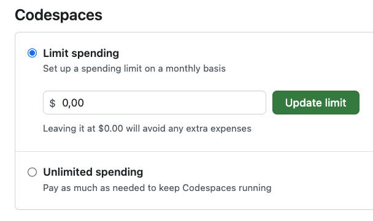
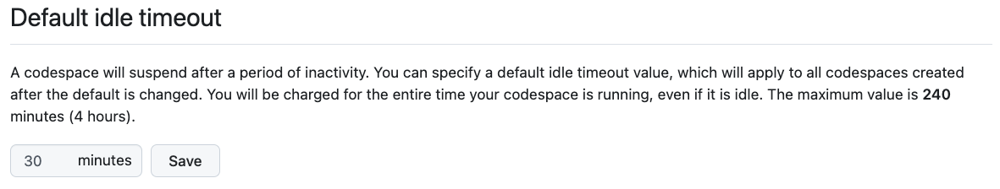
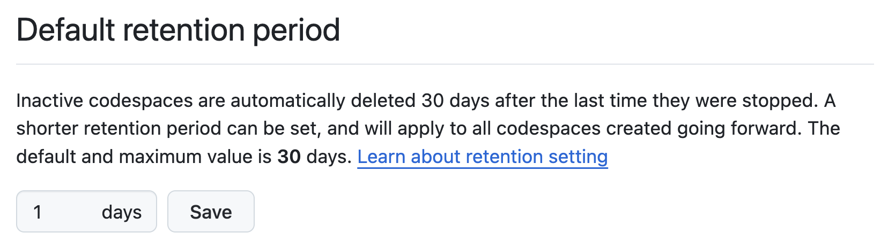
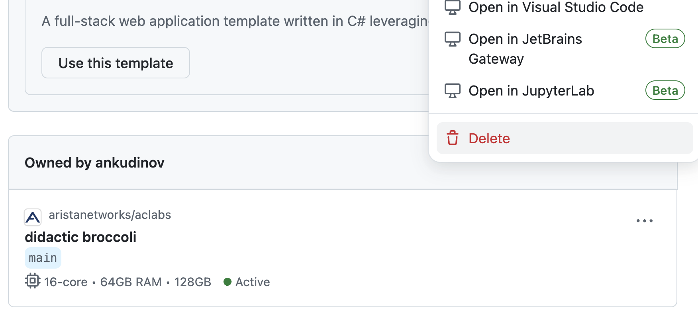
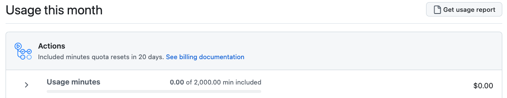
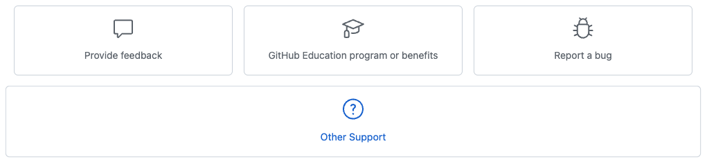

# Codespaces Quickstart Guide

!!! Tip "Github Account"

    You must have a Github account before you start using Github Codespaces. If you don't have one - [register now](https://github.com/signup) and login before you start using acLabs.

    You also have to request access to bigger Codespaces instances from [Github Support](https://support.github.com/) to run some labs. It usually takes a few days before it's active.

## What is Github Codespaces

[Github Codespaces](https://github.com/features/codespaces) allows you to start a fully configured development environment directly on the Github cloud infrastructure. There is no need to setup your own machine and with the help of a [deep link](https://docs.github.com/en/codespaces/setting-up-your-project-for-codespaces/setting-up-your-repository/facilitating-quick-creation-and-resumption-of-codespaces#creating-a-link-to-the-codespace-creation-page-for-your-repository) the entire environment can be started by pressing a button.

In our case the development environment means - all the tools we need to start playing with the network lab and the lab infrastructure itself. With the power of [docker-in-docker](https://github.com/microsoft/vscode-dev-containers/blob/main/containers/docker-in-docker/README.md) Codespaces help to encapsulate all that into a single container. The best part is that Codespaces are based on the [dev container specification](https://containers.dev/implementors/spec/) and dev containers can be started on any other machine with the power of VSCode or another supporting tool, making the environment fully portable.(1)
{ .annotate }

1. At the time of writing the cEOS-lab images for ARM are not yet released and the environment portability is limited to x86 machines. ARM support for acLabs is coming later. And a __nerdy warning__: your host setup matters! A bad Docker installation or Linux kernel configuration can break everything.

[Codespaces](https://github.com/features/codespaces) is a commercial feature provided by Github. However as of time of writing it has a very generous free monthly quota of 120 core-hours and 15 GB storage every month. It's a lot of lab time for free and [Github Codespaces pricing](https://docs.github.com/en/billing/managing-billing-for-github-codespaces/about-billing-for-github-codespaces#pricing-for-paid-usage) is very affordable. Let's take deeper look at how Github billing really works.

## Github Codespaces Billing

The first thing to know about Github billing is that you will never be charged by default, unless you change your spending limit.  
To check you spending limit, you can go to your Github account `Settings`(1) > `Billing and plans` > `Spending limits`(2) > `Codespaces` > `Limit spending`(3). The default will be zero. That will prevent any extra expenses and stop all Codespaces when monthly quota is over. However you can certainly consider increasing that to some minimum amount if you plan to run bigger Codespaces instances often enough.
{ .annotate }

1. { .opacity09 }
2. { .opacity09 }
3. { .opacity09 }

When you run a 4-core Codespace instance (the default size available to all Github users) for 1 hour, you'll consume 4 core-hours from your quota. That means, if you run this kind of instance no-stop, you'll be able to run it for 120/4 = 30 hours until your free quota will be over. Core-hours quota will only be used when Codespace is running. When stopped manually or via idle timeout - no core-hours will be billed. The idle timeout is the period of time after which a Codespace will be stopped if not used. Default of 30 minutes is generally fine for all use cases, however you can change it in `Settings` > `Codespaces` > `Default idle timeout`

{ .opacity09 }

The storage is billed monthly, but will be consumed as long as container exists. Even when it's stopped. A Codespace that is using 4GB of storage will consume 4GB out of your 15GB quota if it exists for an entire month (even if not actively used). The retention period defines when the Codespaces will be deleted if not actively used. For an average lab environment it's feasible to reduce the default retention period of 30 days to a lower value in `Settings` > `Codespaces` > `Default retention period`. This will significantly reduce the storage utilization.

{ .opacity09 }

The list of all running Codespaces is available on [github.com/codespaces](https://github.com/codespaces). The best way to reduce CPU and storage utilization is to delete them from the list immediately when you finish working with the lab.

Sometimes it helps to get a detailed billing report for the current month by clicking `Settings`(1) > `Billing and plans` > `Plans and Usage` > `Get usage report`
{ .annotate }

1. { .opacity09 }

{ .opacity09 }

You can find more details about Codespaces billing on [Github documentation](https://docs.github.com/en/billing/managing-billing-for-github-codespaces/about-billing-for-github-codespaces).

## Codespaces Machine Types

By default Github provides access to :fontawesome-solid-microchip: `2 Cores` :fontawesome-solid-memory: `8 GB RAM` and :fontawesome-solid-microchip: `4 Cores`  :fontawesome-solid-memory: `16 GB RAM` Codespaces machines. To run some labs you have to request access to bigger Codespace machines from the [Github Support](https://support.github.com/).

!!! Warning "Payment method"

    When you request access to bigger Codespace machines, Github support may ask you to attach a valid payment method(1) to your Github account. While default spending limit is zero, Github Codespaces are a commercial feature. Make sure you attach the payment method before requesting access. If you prefer to avoid attaching any payment methods to your Github account, you can always run labs on your own host.
    { .annotate }

    1. For example Paypal or credit card.

Feel free to use the following form to request access to :fontawesome-solid-microchip: `8 Cores` :fontawesome-solid-memory: `32 GB RAM` and :fontawesome-solid-microchip: `16 Cores` :fontawesome-solid-memory: `64 GB RAM` machines(1):
{ .annotate }

1. Codespaces also provide a "secret" :fontawesome-solid-microchip: `32 Cores` :fontawesome-solid-memory: `128 GB RAM` machines and some AI offering. However this is not required to run acLabs, consumes your quota very fast and not required for most users.

!!! Note "Message template for Github Support"

    Dear Github support,
    I'm a new user of Github Codespaces. It's an amazing feature, unfortunately the default 2 and 4-core machines are sufficient for all my use cases.

    I'd like to request access to 8 core / 32 GB RAM and 16 core / 64 GB RAM machines. Could you please enable that for my account?

    I've added a valid payment method to my Github account already.

???- Question "How To open a support ticket"

    1. Go to the bottom of the [Github Support page](https://support.github.com/) and click `Contact Support`

        { .opacity09 }

    2. Click `Other Support` at the very bottom

        { .opacity09 }

    3. Fill in the `Get help with GitHub` form and use the template above. Click on `Create a ticket`

        
