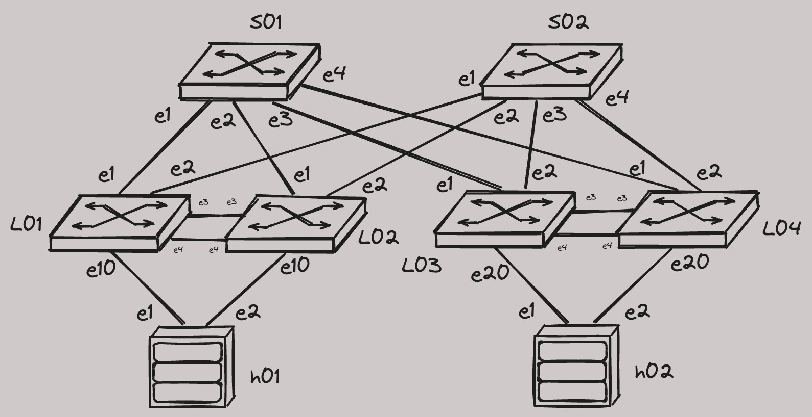

# CVaaS and AVD Demo, EVPN MLAG

!!! Warning "Container Requirements"

    :fontawesome-solid-microchip: CPUs: 8  
    :fontawesome-solid-memory: Memory: 32 GB  
    :fontawesome-solid-hard-drive: Storage: 64 GB  

    :material-alert-circle-outline:{ .heartbeat } Please request high spec Codespace machines from [Github support](https://support.github.com/) first!

[Slides](https://{{gh.org_name}}.github.io/{{gh.repo_name}}/slides/cvaas-cvaas-and-avd-demo--evpn-mlag.html){ target=_blank }  
[PDF Slides](https://{{gh.org_name}}.github.io/{{gh.repo_name}}/pdfs/cvaas-cvaas-and-avd-demo--evpn-mlag.pdf){ target=_blank }

## How To Run The Lab

Please read the [Quickstart guide](https://ankudinov.github.io/aclabs/quickstart/) before using the lab.

You can run the lab on [Github Codespaces](https://codespaces.new/{{gh.repository}}/tree/{{gh.branch}}?quickstart=1&devcontainer_path=.devcontainer%2Fcvaas-cvaas-and-avd-demo--evpn-mlag%2Fdevcontainer.json) or your own machine.

[Start :octicons-play-16: "CVaaS and AVD Demo, EVPN MLAG" in Codespace :octicons-mark-github-24:](https://codespaces.new/{{gh.repository}}/tree/{{gh.branch}}?quickstart=1&devcontainer_path=.devcontainer%2Fcvaas-cvaas-and-avd-demo--evpn-mlag%2Fdevcontainer.json){ .md-button .md-button--primary target=_blank}

To run the lab on your own machine, you can download all required files using the button below.

[Download all required lab files](https://{{gh.org_name}}.github.io/aclabs/lab_archives/cvaas-cvaas-and-avd-demo--evpn-mlag.tar.gz){ .md-button .md-button--primary target=_blank}

> WARNING: Currently only x86 hosts are supported. cEOS-lab for ARM is not yet available and it's not possible to start the lab on your MacBook yet.

!!! info "Environment variables and secrets"

    This lab requires following environment variables and secrets to be set.

    `ARISTA_TOKEN` - the token required to download cEOS-lab image from [arista.com](https://arista.com).
    `CV_API_TOKEN` - CVaaS service account token. It's required to generate onboarding token on CVaaS and allow streaming from the lab devices.
    `CVURL` (Optional) - URL to be used to access CVaaS. Default is `www.cv-staging.corp.arista.io`

    When starting the lab on Github Codespaces, the required data can be provided via `Create codespace` form if not yet associated with the repository. When running the lab on your own machine - set corresponding environment variables **BEFORE** :warning: opening the VSCode.

???+ Tip "Wait until the lab is ready"

    When lab container starts, the `postCreate.sh` takes care of cEOS-lab image download and making some last minute changes in the lab environment. After that, `make start` shortcut is executed to start the lab.
    This requires a some time. :stopwatch: Please be patient. :coffee: :croissant:
    Sometimes cEOS-lab image download may fail. For example, due to incorrect token. In that case `postCreate.sh` script will fail and the lab will not be started.  
    You can confirm if image was imported correctly with `docker image ls`.  

## Lab Inventory

This lab has following devices:

| Hostname | Type | OS | Management Address | Username | Password |
| -------- | ---- | -- | ------------------ | -------- | -------- |
| s01 | switch | cEOS-lab, 4.32.3M | 10.0.1.1 | arista | arista |
| s02 | switch | cEOS-lab, 4.32.3M | 10.0.1.2 | arista | arista |
| l01 | switch | cEOS-lab, 4.32.3M | 10.0.2.1 | arista | arista |
| l02 | switch | cEOS-lab, 4.32.3M | 10.0.2.2 | arista | arista |
| l03 | switch | cEOS-lab, 4.32.3M | 10.0.2.3 | arista | arista |
| l04 | switch | cEOS-lab, 4.32.3M | 10.0.2.4 | arista | arista |
| h01 | host | cEOS-lab, 4.32.3M | 10.0.3.1 | arista | arista |
| h02 | host | cEOS-lab, 4.32.3M | 10.0.3.2 | arista | arista |

> To access any device, use `ssh <username>@<hostname>` or simply type `<hostname>` to use the SSH alias.

## Last Updated

!!! Info "Last reviewed: 13/01/2025"

    Demos and labs reviewed over 6 month age may be outdated.

# Lab Topology



# How To Use The Lab

???+ Tip "Wait until all devices will start streaming to CVaaS."

    This may take a while.

```bash
# 1. build configs with AVD
make build
# 2. create CVP change control (1)
make deploy_cvp
# 3. assign tags for CVP topology view (2)
make tags
# 4. validate the deployment with ANTA preview
make test
```

1. !!! Tip "Review and execute the change control on CVP when all tasks will be created. If you don't have CVaaS available and prefer to deploy the configuration via eAPI, you can use `make deploy` shortcut instead."
2. !!! Bug "Currently there is a bug with disabling LLDP on Ma0, which prevents topology view from functioning correctly."

Connect to a host (h01 or h02) and execute `test` alias to confirm connectivity.  
Execute following commands to verify EVPN control plane:

```text
show ip bgp summary
show bgp evpn summary
show bgp evpn route-type ip-prefix ipv4
show bgp evpn route-type mac-ip
```

Do any other testing in the lab.  
Impress your customer, colleagues or make yourself a bit smarter and happier.  
You rock! 🚀
