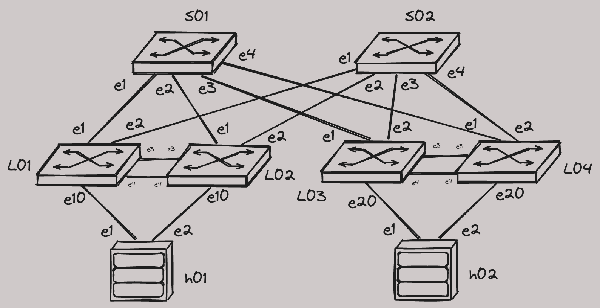

# CVaaS and AVD Demo, EVPN MLAG

!!! Info "Lab Details"

    :fontawesome-solid-tag: **AVD Version:** 6.1.0  
    :fontawesome-solid-network-wired: **cEOS-lab:** 4.34.2F  
    :fontawesome-solid-flask: **Containerlab:** 0.74.3  

    

[Slides](https://{{gh.org_name}}.github.io/{{gh.repo_name}}/slides/cvaas-cvaas-and-avd-demo--evpn-mlag.html){ target=_blank }  
[PDF Slides](https://{{gh.org_name}}.github.io/{{gh.repo_name}}/pdfs/cvaas-cvaas-and-avd-demo--evpn-mlag.pdf){ target=_blank }

!!! Warning

    Automated CVaaS onboarding support is temporarily removed due to backend change from Codespaces to GCP via [labs.arista.com](https://labs.arista.com/). We are working hard on an improved onboarding feature.
    Onboard the lab manually if required!

## How To Run The Lab

Arista Community Lab runs in a cloud-based lab environment sponsored by Arista [^1]. To get started, sign in at [labs.arista.com](https://labs.arista.com/) and click the button below to launch the lab.

[Start the lab :octicons-play-16:](https://labs.arista.com/launch?lab_type=cvaas-cvaas-and-avd-demo--evpn-mlag&origin=tech-lib){ .md-button .md-button--primary target=_blank}

All lab files are also available for [download](https://{{gh.org_name}}.github.io/{{gh.repo_name}}/lab_archives/cvaas-cvaas-and-avd-demo--evpn-mlag.tar.gz) if you want to run the lab on your own machine. This option is intended for experienced users who can manage the environment without extra support.

## Lab Inventory

This lab has following devices:

| Hostname | Type | OS | Management Address | Username | Password |
| -------- | ---- | -- | ------------------ | -------- | -------- |
| s01 | switch | cEOS-lab, 4.34.2F | 10.0.1.1 | arista | arista |
| s02 | switch | cEOS-lab, 4.34.2F | 10.0.1.2 | arista | arista |
| l01 | switch | cEOS-lab, 4.34.2F | 10.0.2.1 | arista | arista |
| l02 | switch | cEOS-lab, 4.34.2F | 10.0.2.2 | arista | arista |
| l03 | switch | cEOS-lab, 4.34.2F | 10.0.2.3 | arista | arista |
| l04 | switch | cEOS-lab, 4.34.2F | 10.0.2.4 | arista | arista |
| h01 | host | cEOS-lab, 4.34.2F | 10.0.3.1 | arista | arista |
| h02 | host | cEOS-lab, 4.34.2F | 10.0.3.2 | arista | arista |

> To access any device, use `ssh <username>@<hostname>` or simply type `<hostname>` to use the SSH alias.

## Last Updated

!!! Info "Last reviewed: 21/05/2026"

    Demos and labs reviewed more than 6 months ago may be outdated.

# How To Use The Lab

???+ Tip "Use the eAPI workflow by default."

    `make deploy` works out of the box in the hosted lab.
    Use `make deploy_cvp` only after manually onboarding the switches and exporting `CVURL` and `CV_API_TOKEN`.

```bash
# 1. build configs with AVD
make build
# 2. deploy configs directly to the lab switches with eAPI
make deploy
# 3. validate the deployment with ANTA
make test
```

Connect to a host (h01 or h02) and execute `test` alias to confirm connectivity.  
Execute following commands to verify EVPN control plane:

```text
show ip bgp summary
show bgp evpn summary
show bgp evpn route-type ip-prefix ipv4
show bgp evpn route-type mac-ip
```

Do any other testing in the lab.  
You rock! 🚀

[^1]: GitHub Codespaces support was removed due to platform restrictions. Use labs.arista.com instead; it is available to all users with an arista.com account.
