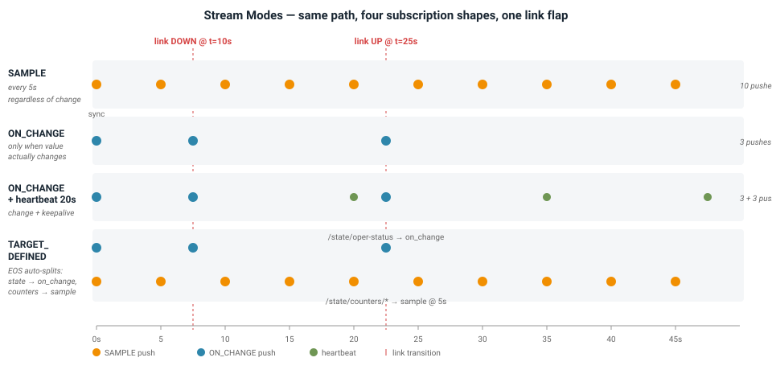

# **Exploring the Lab**

The reference sections above describe *what* the lab is. The subsections below are hands-on tasks that walk you through *how to use it* — one section per pipeline layer, ordered the way you actually work with them.

Each task follows the same shape: **Task** → **Expected**.

!!! info "Environment"
    All `G` / `GO` commands below wrap the `gnmic` and `gnoic` binaries baked into the collector container. Set these aliases once in your host terminal:

    ```bash
    alias G='docker exec -i gnmic /app/gnmic -u arista -p arista --insecure'
    alias GO='docker exec -i gnmic /app/gnoic -u arista -p arista --insecure'
    ```

    Zsh treats `[name=…]` as a filename glob and errors with `zsh: no matches found` if the path is unquoted. All `--path` arguments below are single-quoted for that reason.

    Shells: host terminal (runs `G` / `GO`), switch CLI (`docker exec -it <host> Cli`), switch Linux shell (`docker exec -it <host> bash`), client (`docker exec -it client1 bash`). `<host>` is one of `spine1`, `spine2`, `pe11`, `pe12`, `pe21`, `pe22`.

## **gNMI Read**

The read-side of gNMI: discover what the switch supports, fetch state on demand, and pick the right YANG origin.

### **Capabilities**

Every gNMI client should call `Capabilities` once on connect to know what the server can do. It returns the gNMI version, supported wire encodings, and the YANG models the switch has loaded.

**Task.**

```bash
G -a spine1:6030 capabilities | less
```

**Expected.** A `gNMI version:` line (≥ 0.7), a `supported encodings:` list (JSON, JSON_IETF, ASCII, PROTO), and a long list of `name: <model>, version: ..., organization: ...` entries covering both OpenConfig (`openconfig-*`) and Arista-specific augments (`arista-*`).

### **Get: paths, types, and the cli origin**

`Get` is a one-shot read. `--path` can be repeated for multi-path reads in a single RPC. `--type` filters what part of the tree to return. The `cli:` origin returns the same JSON EOS produces via `show ... | json` — handy when the OpenConfig walk is verbose.

**Task.** Single path, multi-path, type filter, and the cli origin:

```bash
G -a spine1:6030 get --path '/system/state/hostname'

G -a spine1:6030 get \
  --path '/system/state/hostname' \
  --path '/system/state/boot-time' \
  --path '/system/state/current-datetime'

G -a spine1:6030 get --type CONFIG --path '/interfaces/interface[name=Ethernet1]/config'
G -a spine1:6030 get --type STATE  --path '/interfaces/interface[name=Ethernet1]/state'
G -a spine1:6030 get --type OPERATIONAL --path '/interfaces/interface[name=Ethernet1]/state'

G -a spine1:6030 --gzip get \
  --path 'cli:/show bgp evpn summary' \
  --path 'cli:/show vxlan vni'
```

**Expected.** JSON payloads for each path. `CONFIG` returns intended configuration only; `STATE` returns operational state (session-state, message counters); `OPERATIONAL` returns only runtime-computed values (a subset of state); the default returns everything. The `cli:` calls return the same shape as `show ... | json`.

### **Origins: OpenConfig vs eos_native vs cli**

Every path in gNMI carries an origin qualifier that tells the server which YANG tree to walk. Same underlying facts can appear under multiple origins with different shape and coverage.

**Task.** Same concept via three origins.

```bash
G -a spine1:6030 get --path '/components/component[name=CPU0]/cpu/utilization/state'
G -a spine1:6030 get --path 'eos_native:/Kernel/sysinfo'
G -a spine1:6030 get --path 'cli:/show version'
```

**Expected.**

- **OpenConfig** returns a well-defined `avg-usage-percent` structure — vendor-neutral, portable, but coverage lags real features.
- **`eos_native:`** returns the raw Sysdb view with load averages and process counts — Arista-specific but complete. If empty, the switch is missing `provider eos-native` under `management api gnmi`.
- **`cli:`** returns the JSON EOS produces for `show version` — a familiar shape when you need a specific CLI's output.

Rule of thumb: prefer OpenConfig for portability, drop to `eos_native:` when OpenConfig has a gap, use `cli:` for one-off diagnostics.


## **gNMI Subscribe & Stream Modes**

`Subscribe` is the RPC that powers streaming telemetry. The subscription's *stream mode* governs when the server pushes updates: on a fixed cadence, only on value change, or a mix picked per-leaf.



### **ONCE vs STREAM**

**Task.**

```bash
G -a spine1:6030 subscribe --mode once --path '/system/state'
G -a spine1:6030 subscribe --path '/system/state' --sample-interval 10s
```
Ctrl-C after 30s on the stream.

**Expected.** `once` returns one batch and exits. `stream` prints a sync marker, then a fresh payload every 10s.

### **SAMPLE**

The server pushes on every interval regardless of value change. Right for counters, gauges, temperatures. Wrong for enums.

**Task.**

```bash
G -a spine1:6030 subscribe \
  --stream-mode sample --sample-interval 5s \
  --path '/interfaces/interface[name=Ethernet1]/state/counters/in-octets'
```

**Expected.** One update every 5s, `in-octets` monotonically increasing.

!!! note "Interval selection"
    Pick the interval by the leaf's rate of change and the alerting latency you need. Counters 5–30s; slow-moving inventory 60s+. Stream cost scales with `paths × interfaces × sample_rate` — do not set 1s intervals on wildcarded subtrees.

### **ON_CHANGE (with and without heartbeat)**

The server pushes only when the value changes. Right for enums and event-like state (link up/down, BGP session state). Wrong for counters. `--heartbeat-interval` adds a periodic "still alive" push so silence doesn't get mistaken for a dead switch.

**Task.** Correct use — link state:

```bash
G -a spine1:6030 subscribe --stream-mode on_change \
  --path '/interfaces/interface[name=Ethernet1]/state/oper-status'
```

In a second terminal:
```bash
docker exec -it spine1 Cli
spine1# configure
spine1(config)# interface Ethernet1
spine1(config-if-Et1)# shutdown
spine1(config-if-Et1)# no shutdown
```

**Expected.** Sync marker, then silence, then two events (`DOWN`, `UP`) firing within milliseconds of each CLI command.

**Task.** Wrong use — counters:

```bash
G -a spine1:6030 subscribe --stream-mode on_change \
  --path '/interfaces/interface[name=Ethernet1]/state/counters/in-octets'
```

**Expected.** A flood of updates — every packet ticks the counter. Do not do this in production.

**Task.** ON_CHANGE + heartbeat — best of both worlds:

```bash
G -a spine1:6030 subscribe --stream-mode on_change \
  --heartbeat-interval 20s \
  --path '/interfaces/interface[name=Ethernet1]/state/oper-status' \
  --format event
```

Let it run for a minute. Then bounce the link from a second terminal.

**Expected.** One event on startup, then a heartbeat every 20s carrying the same value. When you bounce the link, an immediate event arrives on top of the heartbeat cycle.

!!! note "Arista gotcha — `suppress-redundant` is silently ignored"
    gnmic accepts a `suppress-redundant: true` flag that's supposed to skip a sample if the value hasn't changed since the previous one. On Arista EOS (Octa) that flag is accepted and ignored (Bug 779417) — the server pushes on every sample regardless. The only real lever to cut SAMPLE volume is the interval itself.

### **TARGET_DEFINED**

Let EOS pick the mode per leaf across a subtree. Convenient default for broad reads; less predictable than explicit modes.

**Task.**

```bash
G -a spine1:6030 subscribe --stream-mode target_defined --sample-interval 5s \
  --path '/interfaces/interface[name=Ethernet1]/state' \
  --format event
```

**Expected.** EOS auto-splits — `oper-status` and `admin-status` land on ON_CHANGE (initial value then silence), counters (`in-octets`, `out-octets`) land on SAMPLE at 5s. Convenient for broad subtrees; less predictable than the explicit modes.

### **Mixed-mode subscription (production pattern)**

Real deployments care about both alerting latency *and* steady-state observability, so they combine modes inside a single SubscriptionList: `on_change` on state leaves, `sample` on counters, one gRPC connection carrying both. This is the shape you'll write when adding a subscription to `clab/gnmic.yml`.

**Task.** The lab ships an example combo block in `clab/gnmic-stream-modes-demo.yml`. Extract just the mixed-mode block:

```yaml
intf_mixed_modes:
  subscription-mode: stream
  paths:
    # State transitions — react instantly.
    - path: /interfaces/interface[name=Ethernet1]/state/oper-status
      stream-mode: on_change
      heartbeat-interval: 60s
    # Counters — sample every 5s.
    - path: /interfaces/interface[name=Ethernet1]/state/counters/in-octets
      stream-mode: sample
      sample-interval: 5s
    - path: /interfaces/interface[name=Ethernet1]/state/counters/out-octets
      stream-mode: sample
      sample-interval: 5s
```

**Expected.** One SubscriptionList sent to the switch, three paths inside it, each with its own `stream-mode`. On the wire this is one gRPC stream carrying all three. The switch pushes the state leaf on transitions (with a 60s heartbeat), and pushes both counter leaves every 5s.

### **Comparing all modes side-by-side**

The `clab/gnmic-stream-modes-demo.yml` config subscribes to the *same path* in SAMPLE, ON_CHANGE, ON_CHANGE+heartbeat, TARGET_DEFINED, and the mixed-mode combo simultaneously. Writes events to stdout so you can watch each mode fire in real time.

**Task.** Run the demo in an ephemeral collector container that shares the persistent `gnmic` container's network, then bounce `spine1:Ethernet1` from a second terminal.

```bash
cd ~/gnmic-prometheus-grafana
docker run --rm -it \
  --network container:gnmic \
  -v $(pwd)/clab/gnmic-stream-modes-demo.yml:/cfg.yml:ro \
  ghcr.io/openconfig/gnmic:latest \
  --config /cfg.yml subscribe
```

Second terminal:

```
docker exec -it spine1 Cli
spine1# configure
spine1(config)# interface Ethernet1
spine1(config-if-Et1)# shutdown
spine1(config-if-Et1)# no shutdown
```

**Expected.**

- **SAMPLE** fires every 5s regardless of the flap
- **ON_CHANGE** fires only on the two transitions
- **ON_CHANGE + heartbeat** fires on the transitions and every 20s in between
- **TARGET_DEFINED** fires on transitions for `oper-status` and every 5s for the counters
- **Mixed-mode** prints one on_change stream for state and one 5s sample stream for counters

### **Counting event volume — the on_change payoff**

The reason ON_CHANGE exists is bandwidth. On a stable link the difference is dramatic.

**Task.** Run each for 60s on a stable link and count events:

```bash
timeout 60 G -a spine1:6030 subscribe --mode stream --stream-mode sample --sample-interval 5s \
  --path '/interfaces/interface[name=Ethernet1]/state/oper-status' --format event 2>/dev/null \
  | grep -c '"values"'
# → ~12 events

timeout 60 G -a spine1:6030 subscribe --mode stream --stream-mode on_change \
  --path '/interfaces/interface[name=Ethernet1]/state/oper-status' --format event 2>/dev/null \
  | grep -c '"values"'
# → 1 event
```

**Expected.** 12× traffic reduction on the stable path. This is why real dashboards mix modes — ON_CHANGE for enums that rarely fire, SAMPLE for counters where every sample is meaningful.


## **gNMI Write**

The write-side of gNMI: modify configuration in atomic transactions.

### **Set: update, replace, delete**

`Set` is atomic per-RPC — everything in one Set request commits or nothing does. Three sub-operations: `--update` (merge), `--replace` (subtree overwrite), `--delete` (remove).

**Task.**

```bash
# update (merge)
G -a spine1:6030 set \
  --update-path '/interfaces/interface[name=Loopback0]/config/description' \
  --update-value 'set-via-gnmi'

# verify from the CLI
docker exec -it spine1 Cli -c 'show interfaces Loopback0 | include Description'

# delete
G -a spine1:6030 set \
  --delete '/interfaces/interface[name=Loopback0]/config/description'

# replace (full subtree overwrite — anything omitted is deleted)
G -a spine1:6030 set \
  --replace-path '/interfaces/interface[name=Loopback0]/config' \
  --replace-value '{"name":"Loopback0","enabled":true,"description":"replaced-subtree"}'
```

**Expected.** `SetResponse` with a success timestamp for each operation. Update merges into the config leaf. Delete removes it. Replace overwrites the entire subtree.

!!! note "Update vs replace"
    Prefer `update` unless you deliberately want a subtree overwrite. `replace` silently deletes any leaves you omitted from the payload — very easy to accidentally strip config you didn't intend to touch.

!!! note "Concurrent Set is not atomic across RPCs"
    Two operators writing the same leaf simultaneously race — last-writer-wins. In production, serialize Sets through a single client (or use CVP/AVD which coordinates).


## **Configuring the Collector**

Everything Prometheus stores comes from a subscription in `clab/gnmic.yml`. Reading, editing, and introspecting that file is the day-to-day of running the pipeline.

### **Reading the subscription config**

**Task.** Open the file in a pager and answer these questions from the config:

```bash
less clab/gnmic.yml
```

- Which subscription produces the metric `gnmic_bgp_neighbors_session_state`?
- What sample interval does that subscription use?
- `cpu` and `cpu_load_avg` are two different subscriptions — what origin does each use?
- Which subscription produces `gnmic_intf_ctrs_in_octets`?

Then verify against what the collector is actually producing:

```bash
docker exec gnmic wget -qO- localhost:9273/metrics \
  | grep -o 'subscription_name="[^"]*"' | sort -u
```

**Expected.** 17 distinct subscription names — one per block in `clab/gnmic.yml`. Answers from the file: `bgp_neighbors` / 5s / `cpu` uses OpenConfig `components/component/cpu`, `cpu_load_avg` uses `eos_native:/Kernel/sysinfo` / `intf_ctrs`.

### **Adding your own subscription**

**Task.** Add a new persistent subscription for LLDP neighbors.

Append to `clab/gnmic.yml`:

```yaml
  lldp_neighbors:
    paths:
      - /lldp/interfaces/interface[name=*]/neighbors/neighbor/state
    mode: stream
    stream-mode: sample
    sample-interval: 15s
```

Reload the collector — the file is bind-mounted from the host (`clab/topology.clab.yml`), so editing on the host and restarting the container is enough:

```bash
docker restart gnmic
docker exec gnmic wget -qO- http://localhost:9273/metrics | grep gnmic_lldp_neighbors | head -5
```

**Expected.** `gnmic_lldp_neighbors_*` metrics appear within 15s of restart, one per LLDP neighbor per interface, tagged with `source`, `interface_name`, and neighbor identity labels.

For a one-off subscribe with no persistent state and no restart — useful when iterating on a path — drive `gnmic subscribe` directly from the CLI:

```bash
G -a spine1:6030 subscribe \
  --path '/system/state/hostname' \
  --stream-mode sample --sample-interval 10s \
  --format event
```

This prints events to your terminal only — nothing lands in Prometheus. Ctrl-C to stop.

### **Introspecting subscriptions from the switch**

Every gNMI server tracks the subscriptions currently open against it. The fastest way to catch "I think I disabled that subscription but it's still running" is to ask the switch what the collector is asking for.

**Task.**

```bash
G -a spine1:6030 get --path '/telemetry-system/subscriptions'
```

**Expected.** One connected client (the gnmic container's mgmt IP `172.144.100.200`) with 17 SubscriptionList entries — one per subscription in `clab/gnmic.yml`. Each entry lists paths, stream mode, sample interval. If a subscription you thought you removed still shows up, the collector didn't restart cleanly.

### **Proving the processors reshape metrics**

The event processor chain (`extract-vlan-id` → `drop-gr` → `trim-prefixes` → `bounce-map` → `eos-version`) is why a switch's raw YANG update becomes a clean Prometheus metric. Watch the transformation happen.

**Task.** Compare the raw event to the exported metric for the same leaf.

Raw event (before processors):

```bash
G -a spine1:6030 subscribe \
  --path '/interfaces/interface[name=Ethernet1]/state/oper-status' \
  --stream-mode sample --sample-interval 5s --format event
```

The `values` field will contain `{"/interfaces/interface/state/oper-status": "UP"}` — long path, string value.

Now the exported Prometheus metric (after processors):

```bash
docker exec gnmic wget -qO- localhost:9273/metrics \
  | grep 'gnmic_intf_oper_state_oper_status{source="spine1",interface_name="Ethernet1"'
```

**Expected.** Metric name is short (`gnmic_intf_oper_state_oper_status`), value is numeric (`1`). Two processors made that happen: `trim-prefixes` collapsed the long path to just the leaf, `bounce-map` replaced `UP` → `1`.

Find the other three processors' work in the metrics dump:

```bash
# extract-vlan-id — pulled the VLAN id into a label
docker exec gnmic wget -qO- localhost:9273/metrics | grep 'vlan_id=' | head -3

# eos-version — normalised "EOS" → "eos"
docker exec gnmic wget -qO- localhost:9273/metrics | grep 'gnmic_show_ver_version'

# drop-gr — no colliding graceful-restart metrics zeroing out the real pfxRcd counters
docker exec gnmic wget -qO- localhost:9273/metrics | grep -E 'received_prefixes|_pfxRcd' | head -5
```

**Expected.** VLAN metrics carry a `vlan_id="<num>"` label, version metrics show lowercase `"eos"`, and BGP received-prefix counters show real non-zero values (compare against `show ip bgp summary` on a spine to confirm).

!!! note "Processor order matters"
    `drop-gr` runs *before* `trim-prefixes` on purpose. If `trim-prefixes` collapsed both `.../graceful-restart/state/pfxRcd` and the real `.../state/pfxRcd` to the same metric name first, they'd collide and one would silently zero the other. See the inline comment in `clab/gnmic.yml`.


## **Metrics in Prometheus**

Once gnmic exports metrics, Prometheus scrapes them every 5s and stores the time-series. The next exercise proves the data actually makes it there and lets you follow a single leaf across every hop.

### **Tracing a metric end-to-end (four altitudes)**

**Task.** Follow `Ethernet1 oper-status on spine1` from the switch all the way to the Grafana panel.

**Layer 1 — raw gNMI on the switch.** What the switch actually reports:

```bash
G -a spine1:6030 get --path '/interfaces/interface[name=Ethernet1]/state/oper-status'
```

You'll see `oper-status: "UP"` — a string value. Everything downstream is derived from this shape.

**Layer 2 — gnmic's Prometheus exporter.** gnmic subscribes to the same path and converts the notification to Prometheus format on `:9273`. The endpoint isn't published to the host, so exec into the container:

```bash
docker exec gnmic wget -qO- localhost:9273/metrics \
  | grep 'gnmic_intf_oper_state_oper_status{' \
  | grep 'source="spine1"' \
  | grep 'interface_name="Ethernet1"'
```

Expected shape:

```
gnmic_intf_oper_state_oper_status{interface_name="Ethernet1", source="spine1", subscription_name="intf_oper_state"} 1 <timestamp>
```

Two things changed vs. Layer 1: the value is `1` (not `"UP"`) — that's `bounce-map`. The metric name is short — that's `trim-prefixes`.

**Layer 3 — Prometheus HTTP API.** Prometheus scraped that endpoint within the last 5s. Ask Prometheus directly:

```bash
docker exec prometheus wget -qO- \
  'http://localhost:9090/api/v1/query?query=gnmic_intf_oper_state_oper_status{source="spine1",interface_name="Ethernet1"}'
```

The `.data.result[0].value` field is `[<epoch>, "1"]` — the same `1`, now stored in the TSDB with a timestamp.

**Layer 4 — Grafana.** Open `http://<host>:3001`, navigate to the `interface-stats` dashboard, find the *Interface Admin Status Table* panel, filter for `source=spine1` and look up `Ethernet1`. Value shows **Up** (Grafana applies a value mapping `1 → Up`, `0 → Down` for display).

**Expected.** The same underlying state (`"UP"` → `1` → `1` → `Up`) at all four layers, one hop apart. If a hop returns nothing, that's where the bug lives — the pipeline is fully observable end-to-end.


## **Panels in Grafana**

Grafana is the visualization layer. Adding a panel is cheap once the pipeline is flowing — the metric is already scraped, you just have to query it.

### **Authoring a Grafana panel and persisting it**

Panels created in the UI live only until the container is restarted. To make a new panel survive `make stop && make start`, save it to the provisioning directory that's bind-mounted from the host.

**Task.** Build a fabric-wide ingress-bps panel, then persist it.

1. Open `http://<host>:3001`, log in as `arista`/`arista` (or use anonymous Admin).
2. New dashboard → Add visualization → `prometheus` datasource.
3. Query:

    ```promql
    sum by (source) (rate(gnmic_intf_ctrs_in_octets_total[1m])) * 8
    ```

4. Panel title *Aggregate fabric ingress (bps)*, unit `bits/sec`. Legend `{{source}}`. Save.

**Expected.** A time-series with one line per switch. Idle lab hovers near zero; run `iperf3` between clients to see it move.

**Persist the dashboard so it survives a rebuild:**

- Dashboard settings (gear icon) → **JSON Model** → **Copy to clipboard**.
- On your host:

    ```bash
    cat > clab/grafana/provisioning/dashboards/fabric-ingress.json <<'EOF'
    (paste)
    EOF
    docker restart grafana
    ```

- Wait ~10s, refresh the browser. Your dashboard is now provisioned — it survives `make stop && make start` (even with `--reconfigure`) because the folder is bind-mounted from the host.

**Expected.** The provisioning file appears in the container within seconds of the restart, and Grafana's dashboard list shows it under whatever folder the `dashboards.yml` provisioner targets.

!!! note "You did not touch gnmic.yml or prometheus.yml"
    Only the Grafana JSON changed — the metric was already being subscribed, exported, and scraped. That's the whole point of the pipeline: once the data is flowing, adding visualizations is cheap.

### **Interface bounce → end-to-end latency**

**Task.** Measure the delay between a link event on the switch and the value change in Prometheus.

```bash
# Terminal 1 — watcher
while true; do
  curl -s 'http://<host>:9090/api/v1/query?query=gnmic_intf_oper_state_oper_status{source="spine1",interface_name="Ethernet1"}' \
    | python3 -c 'import sys, json; d=json.load(sys.stdin)["data"]["result"]; print(d[0]["value"] if d else "no data")'
  sleep 0.5
done

# Terminal 2 — bounce
date +%s.%N && docker exec spine1 Cli -c 'enable' -c 'configure' -c 'interface Ethernet1' -c 'shutdown'
```

**Expected.** The watcher prints `1` steadily, then `0` within ~1–2 seconds (5s subscription sample + 5s Prometheus scrape; typically well under 5s because they align).


---

**Previous:** [← Telemetry Stack](telemetry-stack.md) &nbsp;·&nbsp; **Next:** [Troubleshooting →](troubleshooting.md) &nbsp;·&nbsp; [Back to guide index](index.md)

--8<-- "gnmic-deployment-guide/_abbreviations.md"