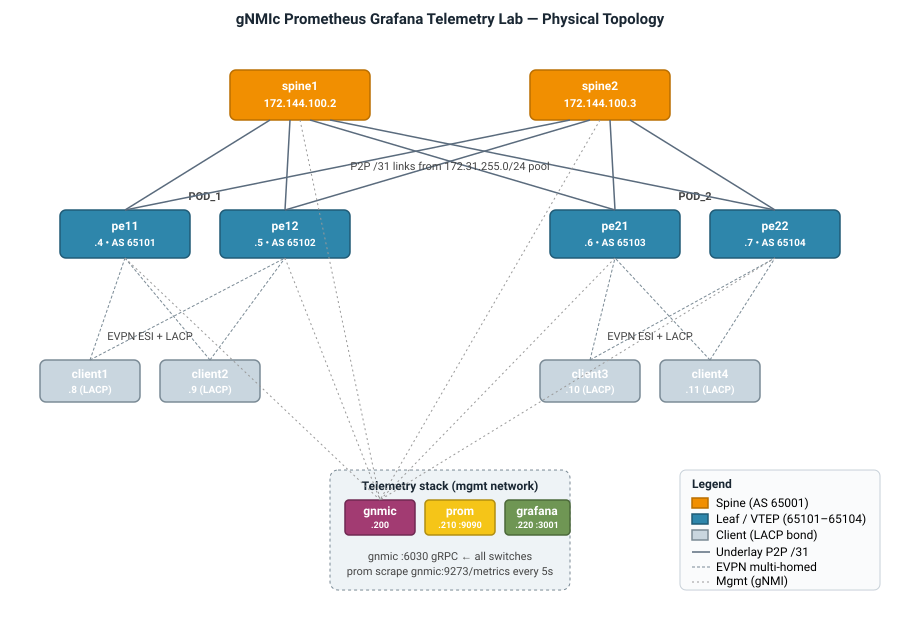
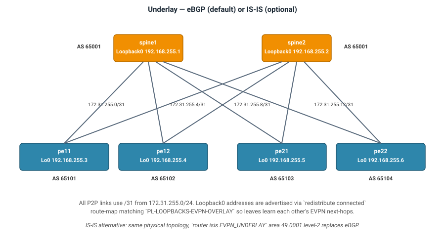
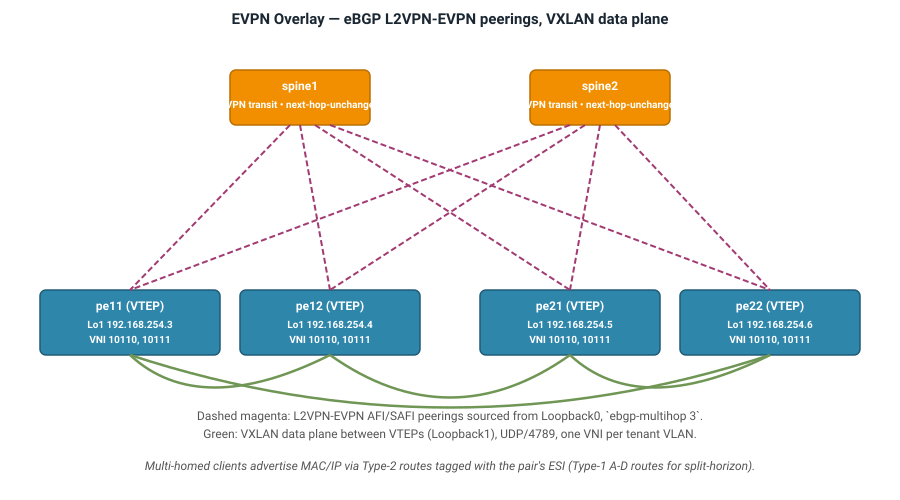
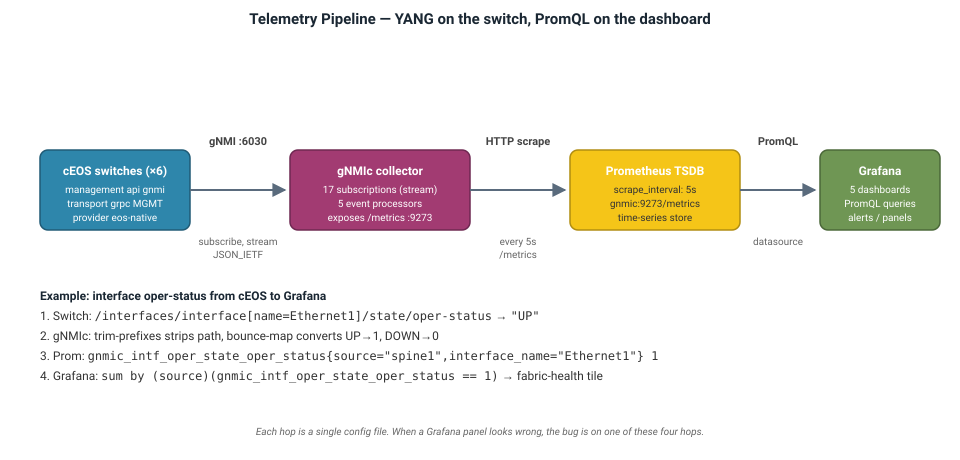

# **gNMIc Prometheus Grafana Telemetry Lab**

!!! tip "Deployment Guide"
    A deep-dive on how the pipeline works, how the fabric is configured, and how to exercise every gNMI RPC and stream mode against the running lab. For the quickstart launch flow, see the [Telemetry lab landing page](../telemetry.md) and the general [aclabs Quickstart](../quickstart.md).

**Deployment guide sections:**

- **[Fabric Configuration](fabric-configuration.md)** — per-role config walkthrough for spines and leaves.
- **[Telemetry Stack](telemetry-stack.md)** — gNMIc collector, Prometheus, Grafana provisioning.
- **[Exploring the Lab](exploring-the-lab.md)** — hands-on tasks covering every gNMI RPC, stream mode, and pipeline trace.

---

## **Getting Started**

### **Launch the lab**

[Start the lab :octicons-play-16:](https://labs.arista.com/launch?lab_type=gnmic-prometheus-grafana&origin=tech-lib){ .md-button .md-button--primary target=_blank}

Sign in at [labs.arista.com](https://labs.arista.com/) and click the button above. The lab spins up all six cEOS switches, four Linux clients, and the gNMIc / Prometheus / Grafana containers pre-configured — no manual setup needed.

### **Prerequisites and access**

The lab runs in Arista's cloud lab environment; anyone with an `arista.com` account can launch it. For general environment guidance (Arista account, browser access, ContainerLab basics), see the [aclabs Quickstart](../quickstart.md). No local install is required to follow this guide.

If you want to run the lab on your own machine instead, all files are downloadable from the [lab tarball](https://aristanetworks.github.io/aclabs/lab_archives/gnmic-prometheus-grafana.tar.gz). Local runs are for experienced users comfortable with Containerlab and cEOS-lab image handling.

### **What you should see first**

Once the lab reports ready:

- All 13 containers show `running` (`make inspect` or the Topology Viewer)
- **Grafana** at `http://<host>:3001` — credentials `arista` / `arista` (anonymous Admin is also enabled). Five dashboards are pre-provisioned; `device-overview` and `interface-stats` populate immediately, `fabric-health` and `evpn-telemetry` populate after the AVD deploy in the next step.
- **Prometheus** at `http://<host>:9090` — no auth. Try the query `up` — you should see one target (`gnmic:9273`) reporting `1`.

Push the fabric configuration to enable EVPN and the L3 dashboards:

```bash
ansible-playbook playbooks/fabric-deploy-config.yaml -i inventory.yaml
```

Once that completes, `l3-telemetry` and `evpn-telemetry` populate. You are now at the starting point for every task in [Exploring the Lab](exploring-the-lab.md).


---

## **Overview**

### **Purpose and audience**

This lab demonstrates a full streaming-telemetry pipeline built on top of a small EVPN VXLAN fabric. Six Arista cEOS switches (2 spines and 4 leaves in two PODs) expose network state via gNMI, an OpenConfig gNMIc collector subscribes to a curated set of YANG paths, the events are re-shaped by processors and exported to Prometheus, and Grafana renders the result across five pre-provisioned dashboards.

Streaming telemetry replaces poll-based monitoring (SNMP, CLI screen-scraping) with a subscribe-once model. The switch pushes typed, YANG-schema values at the interval you request, or the moment they change, over gRPC. This lab exercises all four gNMI RPCs (**Capabilities**, **Get**, **Set**, **Subscribe**), all four stream modes (**ONCE**, **SAMPLE**, **ON_CHANGE**, **TARGET_DEFINED**), and both YANG origins (**OpenConfig** and **eos_native**).

The fabric itself is not the focus. It exists so there is something meaningful to measure: BGP sessions to watch flap, EVPN routes to count, interfaces to bounce, VXLAN tunnels to inspect.

### **Design summary**

=== "Physical Topology"

    

=== "Underlay"

    

=== "EVPN Overlay"

    

=== "Telemetry Pipeline"

    

=== "Summary"

    | Component | Model |
    |---|---|
    | Fabric name (AVD) | `OM_FABRIC` |
    | IPv4 Underlay | eBGP (default) or IS-IS |
    | EVPN Overlay | eBGP |
    | MAC-VRF | VLAN-Based |
    | Multi-Homing | EVPN All-Active (ESI + LACP) |
    | Overlay Multi-Homing bundles | Port-Channel per client, per PE pair |
    | Spanning-tree mode | MST (priority 4096 on leaves) |
    | Fabric MTU | 9214 |
    | Loopback0 (Router ID) pool | `192.168.255.0/24` |
    | Loopback1 (VTEP source) pool | `192.168.254.0/24` |
    | P2P Underlay pool | `172.31.255.0/24` (/31 per link) |
    | Spine ASN | `65001` |
    | Leaf ASN scheme | `65101`, `65102`, `65103`, `65104` |

=== "Node IDs"

    | Node | Role | Loopback0 (Router ID) | Loopback1 (VTEP) | ASN |
    |---|---|---|---|---|
    | `spine1` | Spine | `192.168.255.1` | — | `65001` |
    | `spine2` | Spine | `192.168.255.2` | — | `65001` |
    | `pe11` | Leaf (POD_1) | `192.168.255.3` | `192.168.254.3` | `65101` |
    | `pe12` | Leaf (POD_1) | `192.168.255.4` | `192.168.254.4` | `65102` |
    | `pe21` | Leaf (POD_2) | `192.168.255.5` | `192.168.254.5` | `65103` |
    | `pe22` | Leaf (POD_2) | `192.168.255.6` | `192.168.254.6` | `65104` |
    | `client1`–`client4` | Servers | — | — | — |

=== "Tenant Networks"

    | VLAN | Name | VNI | Multi-Homed From | Clients |
    |---|---|---|---|---|
    | 110 | `Tenant_A_OP_Zone_1` | 10110 | `pe11`+`pe12`, `pe21`+`pe22` | `client1`, `client3` |
    | 111 | `Tenant_A_OP_Zone_2` | 10111 | `pe11`+`pe12`, `pe21`+`pe22` | `client2`, `client4` |

    Each client is dual-attached (LACP bond) to the two leaves in its POD. On the leaf side each attachment terminates in a Port-Channel with an EVPN Ethernet Segment (ESI + LACP system-id) so both leaves advertise the client's MAC/IP as reachable via the same ES.


---

## **Lab Environment**

### **What runs where**

The lab is a Containerlab topology on one management network (`172.144.100.0/24`, VRF `MGMT`). Six cEOS switches carry the fabric; four Linux clients are dual-attached to the leaves; three service containers form the telemetry stack.

| Container | Image | Mgmt IP | Ports exposed to host | Credentials |
|---|---|---|---|---|
| `spine1`, `spine2` | `arista/ceos:latest` (tested 4.34.2F) | `.2`, `.3` | none | `arista` / `arista` |
| `pe11`, `pe12`, `pe21`, `pe22` | `arista/ceos:latest` | `.4`–`.7` | none | `arista` / `arista` |
| `client1`–`client4` | `ghcr.io/aristanetworks/aclabs/host-ubuntu:rev1.0` | `.8`–`.11` | none | — |
| `gnmic` | `ghcr.io/openconfig/gnmic:latest` | `.200` | `9273` (in-cluster only) | `arista` / `arista` |
| `prometheus` | `prom/prometheus:v2.54.1` | `.210` | **`9090` → host** | none |
| `grafana` | `grafana/grafana:11.2.0` | `.220` | **`3001` → host** | `arista` / `arista` |

Only Grafana and Prometheus publish ports to the host. The `gnmic:9273` `/metrics` endpoint is reachable only from inside the Containerlab network — Prometheus scrapes it there, and to query it from the host you `docker exec` into the `gnmic` container.

### **Underlay variant toggle**

The fabric supports two underlay routing protocols; the EVPN overlay is eBGP in both cases.

| Variant | How to deploy | AVD renders |
|---|---|---|
| **eBGP underlay** (default) | `ansible-playbook playbooks/fabric-deploy-config.yaml` | `router bgp` with per-leaf ASNs |
| **IS-IS underlay** | `ansible-playbook playbooks/fabric-deploy-config.yaml -e underlay_routing_protocol=isis` | `router isis EVPN_UNDERLAY`, level-2, area 49.0001 |

The IS-IS variant enables the `isis_adjacencies` subscription in `clab/gnmic.yml`; in the eBGP build that subscription silently returns no data.

### **Telemetry subscriptions catalog**

All subscriptions run in `stream` mode against every switch. Origin is OpenConfig unless prefixed with `eos_native:`.

| Subscription | Path | Stream Mode | Sample Interval |
|---|---|---|---|
| `bgp_neighbors` | `/network-instances/network-instance[name=default]/protocols/protocol[name=BGP]/bgp/neighbors` | sample | 5s |
| `cpu` | `components/component/cpu` | sample | 5s |
| `cpu_load_avg` | `eos_native:/Kernel/sysinfo` | sample | 5s |
| `processes` | `system/processes/process/state` | sample | 15s |
| `memory` | `components/component/state/memory/`, `system/memory/kernel/state`, `system/memory/state` | sample | 5s |
| `intf_ctrs` | `/interfaces/interface[name=*]/state/counters` | sample | 5s |
| `intf_admin_state` | `/interfaces/interface[name=*]/state/admin-status` | sample | 5s |
| `intf_oper_state` | `/interfaces/interface[name=*]/state/oper-status` | sample | 5s |
| `intf_config` | `interfaces/interface/subinterfaces/subinterface/ipv4/addresses/address/config` | sample | 5s |
| `show_ver` | `eos_native:/Eos/image` | sample | 60s |
| `boot_time` | `system/state/boot-time` | sample | 60s |
| `hardware` | `components/component/state`, `eos_native:/Sysdb/hardware/entmib` | sample | 60s |
| `isis_adjacencies` | `/network-instances/network-instance[name=default]/protocols/protocol[name=EVPN_UNDERLAY]/isis` | sample | 10s |
| `mac_table` | `network-instances/network-instance[name=default]/fdb/mac-table/entries/entry` | sample | 30s |
| `arp` | `/interfaces/interface/subinterfaces/subinterface/ipv4/neighbors/neighbor` | sample | 30s |
| `vlan_internal` | `eos_native:/Sysdb/bridging/config/vlanConfig` | sample | 30s |
| `conn_mon` | `arista/connectivity-monitor/clients/client` | sample | 10s |

Each subscription's shape (path, mode, interval) is authored in [`clab/gnmic.yml`](https://github.com/aristanetworks/aclabs/blob/main/labs/gnmic-prometheus-grafana/clab/gnmic.yml). See [Telemetry Stack → gNMIc Collector](telemetry-stack.md#gnmic-collector) for the raw YAML and processor chain that reshapes these into Prometheus metrics.


---

## **Appendix**

### **Full spine configuration**

??? details "Complete `spine1` running configuration as rendered by AVD"

    ```
    !
    no enable password
    no aaa root
    !
    username arista privilege 15 role network-admin secret sha512 $6$7t1sx38LSYabjfkz$TNsa1HyVX4kehVvqFvJVF1omlYKxUkeAV4AfDlJ3tQnSoR1GfaaaicGyKjVJG/s63wxiTW1zgbchOH2dZ38lH.
    !
    vlan internal order ascending range 1006 1199
    !
    transceiver qsfp default-mode 4x10G
    !
    service routing protocols model multi-agent
    !
    hostname om-spine1
    ip name-server vrf MGMT 1.1.1.1
    ip name-server vrf MGMT 8.8.8.8
    !
    spanning-tree mode mstp
    !
    vrf instance MGMT
    !
    management api http-commands
       protocol https
       protocol https ssl profile eAPI
       no shutdown
       !
       vrf MGMT
      no shutdown
    !
    management api gnmi
       transport grpc default
      notification timestamp send-time
       !
       transport grpc MGMT
      vrf MGMT
      notification timestamp send-time
       provider eos-native
    !
    management security
       !
       ssl profile eAPI
      cipher-list HIGH:!eNULL:!aNULL:!MD5:!ADH:!ANULL
      certificate eAPI.crt key eAPI.key
    !
    interface Ethernet1
       description P2P_om-pe11_Ethernet1
       no shutdown
       mtu 9214
       no switchport
       ip address 172.31.255.0/31
    !
    interface Ethernet2
       description P2P_om-pe12_Ethernet1
       no shutdown
       mtu 9214
       no switchport
       ip address 172.31.255.4/31
    !
    interface Ethernet3
       description P2P_om-pe21_Ethernet1
       no shutdown
       mtu 9214
       no switchport
       ip address 172.31.255.8/31
    !
    interface Ethernet4
       description P2P_om-pe22_Ethernet1
       no shutdown
       mtu 9214
       no switchport
       ip address 172.31.255.12/31
    !
    interface Loopback0
       description ROUTER_ID
       no shutdown
       ip address 192.168.255.1/32
    !
    interface Management0
       description OOB_MANAGEMENT
       no shutdown
       vrf MGMT
       ip address 172.144.100.2/24
    !
    ip routing
    no ip routing vrf MGMT
    !
    ip prefix-list PL-LOOPBACKS-EVPN-OVERLAY
       seq 10 permit 192.168.255.0/24 eq 32
    !
    ip route vrf MGMT 0.0.0.0/0 172.144.100.1
    !
    ntp server vrf MGMT time.google.com prefer
    !
    route-map RM-CONN-2-BGP permit 10
       match ip address prefix-list PL-LOOPBACKS-EVPN-OVERLAY
    !
    router bfd
       multihop interval 300 min-rx 300 multiplier 3
    !
    router bgp 65001
       router-id 192.168.255.1
       no bgp default ipv4-unicast
       distance bgp 20 200 200
       maximum-paths 4 ecmp 4
       neighbor EVPN-OVERLAY-PEERS peer group
       neighbor EVPN-OVERLAY-PEERS next-hop-unchanged
       neighbor EVPN-OVERLAY-PEERS update-source Loopback0
       neighbor EVPN-OVERLAY-PEERS bfd
       neighbor EVPN-OVERLAY-PEERS ebgp-multihop 3
       neighbor EVPN-OVERLAY-PEERS password 7 q+VNViP5i4rVjW1cxFv2wA==
       neighbor EVPN-OVERLAY-PEERS send-community
       neighbor EVPN-OVERLAY-PEERS maximum-routes 0
       neighbor IPv4-UNDERLAY-PEERS peer group
       neighbor IPv4-UNDERLAY-PEERS password 7 AQQvKeimxJu+uGQ/yYvv9w==
       neighbor IPv4-UNDERLAY-PEERS send-community
       neighbor IPv4-UNDERLAY-PEERS maximum-routes 12000
       neighbor 172.31.255.1 peer group IPv4-UNDERLAY-PEERS
       neighbor 172.31.255.1 remote-as 65101
       neighbor 172.31.255.1 description om-pe11_Ethernet1
       neighbor 172.31.255.5 peer group IPv4-UNDERLAY-PEERS
       neighbor 172.31.255.5 remote-as 65102
       neighbor 172.31.255.5 description om-pe12_Ethernet1
       neighbor 172.31.255.9 peer group IPv4-UNDERLAY-PEERS
       neighbor 172.31.255.9 remote-as 65103
       neighbor 172.31.255.9 description om-pe21_Ethernet1
       neighbor 172.31.255.13 peer group IPv4-UNDERLAY-PEERS
       neighbor 172.31.255.13 remote-as 65104
       neighbor 172.31.255.13 description om-pe22_Ethernet1
       neighbor 192.168.255.3 peer group EVPN-OVERLAY-PEERS
       neighbor 192.168.255.3 remote-as 65101
       neighbor 192.168.255.3 description om-pe11_Loopback0
       neighbor 192.168.255.4 peer group EVPN-OVERLAY-PEERS
       neighbor 192.168.255.4 remote-as 65102
       neighbor 192.168.255.4 description om-pe12_Loopback0
       neighbor 192.168.255.5 peer group EVPN-OVERLAY-PEERS
       neighbor 192.168.255.5 remote-as 65103
       neighbor 192.168.255.5 description om-pe21_Loopback0
       neighbor 192.168.255.6 peer group EVPN-OVERLAY-PEERS
       neighbor 192.168.255.6 remote-as 65104
       neighbor 192.168.255.6 description om-pe22_Loopback0
       redistribute connected route-map RM-CONN-2-BGP
       !
       address-family evpn
      neighbor EVPN-OVERLAY-PEERS activate
       !
       address-family ipv4
      no neighbor EVPN-OVERLAY-PEERS activate
      neighbor IPv4-UNDERLAY-PEERS activate
       !
       address-family rt-membership
      neighbor EVPN-OVERLAY-PEERS activate
      neighbor EVPN-OVERLAY-PEERS default-route-target only
    !
    end
    ```

### **Full leaf configuration**

??? details "Complete `pe11` running configuration as rendered by AVD"

    ```
    !
    no enable password
    no aaa root
    !
    username arista privilege 15 role network-admin secret sha512 $6$7t1sx38LSYabjfkz$TNsa1HyVX4kehVvqFvJVF1omlYKxUkeAV4AfDlJ3tQnSoR1GfaaaicGyKjVJG/s63wxiTW1zgbchOH2dZ38lH.
    !
    vlan internal order ascending range 1006 1199
    !
    transceiver qsfp default-mode 4x10G
    !
    service routing protocols model multi-agent
    !
    hostname om-pe11
    ip name-server vrf MGMT 1.1.1.1
    ip name-server vrf MGMT 8.8.8.8
    !
    spanning-tree mode mstp
    spanning-tree mst 0 priority 4096
    !
    vlan 110
       name Tenant_A_OP_Zone_1
    !
    vlan 111
       name Tenant_A_OP_Zone_2
    !
    vrf instance MGMT
    !
    management api http-commands
       protocol https
       protocol https ssl profile eAPI
       no shutdown
       !
       vrf MGMT
          no shutdown
    !
    management api gnmi
       transport grpc default
          notification timestamp send-time
       !
       transport grpc MGMT
          vrf MGMT
          notification timestamp send-time
       provider eos-native
    !
    management security
       !
       ssl profile eAPI
          cipher-list HIGH:!eNULL:!aNULL:!MD5:!ADH:!ANULL
          certificate eAPI.crt key eAPI.key
    !
    interface Port-Channel3
       description PortChannel3
       no shutdown
       switchport trunk allowed vlan 110
       switchport mode trunk
       switchport
       !
       evpn ethernet-segment
          identifier 0000:0000:0101:0102:0033
          route-target import 01:01:01:02:00:33
       lacp system-id 0101.0102.0033
       spanning-tree portfast
    !
    interface Port-Channel4
       description PortChannel4
       no shutdown
       switchport trunk allowed vlan 111
       switchport mode trunk
       switchport
       !
       evpn ethernet-segment
          identifier 0000:0000:0101:0102:0044
          route-target import 01:01:01:02:00:44
       lacp system-id 0101.0102.0044
       spanning-tree portfast
    !
    interface Ethernet1
       description P2P_om-spine1_Ethernet1
       no shutdown
       mtu 9214
       no switchport
       ip address 172.31.255.1/31
    !
    interface Ethernet2
       description P2P_om-spine2_Ethernet1
       no shutdown
       mtu 9214
       no switchport
       ip address 172.31.255.3/31
    !
    interface Ethernet3
       description SERVER_server01_Eth1
       no shutdown
       channel-group 3 mode active
    !
    interface Ethernet4
       description SERVER_server02_Eth1
       no shutdown
       channel-group 4 mode active
    !
    interface Loopback0
       description ROUTER_ID
       no shutdown
       ip address 192.168.255.3/32
    !
    interface Loopback1
       description VXLAN_TUNNEL_SOURCE
       no shutdown
       ip address 192.168.254.3/32
    !
    interface Management0
       description OOB_MANAGEMENT
       no shutdown
       vrf MGMT
       ip address 172.144.100.4/24
    !
    interface Vxlan1
       description om-pe11_VTEP
       vxlan source-interface Loopback1
       vxlan udp-port 4789
       vxlan vlan 110 vni 10110
       vxlan vlan 111 vni 10111
    !
    ip routing
    no ip routing vrf MGMT
    !
    ip prefix-list PL-LOOPBACKS-EVPN-OVERLAY
       seq 10 permit 192.168.255.0/24 eq 32
       seq 20 permit 192.168.254.0/24 eq 32
    !
    ip route vrf MGMT 0.0.0.0/0 172.144.100.1
    !
    ntp server vrf MGMT time.google.com prefer
    !
    route-map RM-CONN-2-BGP permit 10
       match ip address prefix-list PL-LOOPBACKS-EVPN-OVERLAY
    !
    router bfd
       multihop interval 300 min-rx 300 multiplier 3
    !
    router bgp 65101
       router-id 192.168.255.3
       no bgp default ipv4-unicast
       distance bgp 20 200 200
       maximum-paths 4 ecmp 4
       neighbor EVPN-OVERLAY-PEERS peer group
       neighbor EVPN-OVERLAY-PEERS update-source Loopback0
       neighbor EVPN-OVERLAY-PEERS bfd
       neighbor EVPN-OVERLAY-PEERS ebgp-multihop 3
       neighbor EVPN-OVERLAY-PEERS password 7 q+VNViP5i4rVjW1cxFv2wA==
       neighbor EVPN-OVERLAY-PEERS send-community
       neighbor EVPN-OVERLAY-PEERS maximum-routes 0
       neighbor IPv4-UNDERLAY-PEERS peer group
       neighbor IPv4-UNDERLAY-PEERS password 7 AQQvKeimxJu+uGQ/yYvv9w==
       neighbor IPv4-UNDERLAY-PEERS send-community
       neighbor IPv4-UNDERLAY-PEERS maximum-routes 12000
       neighbor 172.31.255.0 peer group IPv4-UNDERLAY-PEERS
       neighbor 172.31.255.0 remote-as 65001
       neighbor 172.31.255.0 description om-spine1_Ethernet1
       neighbor 172.31.255.2 peer group IPv4-UNDERLAY-PEERS
       neighbor 172.31.255.2 remote-as 65001
       neighbor 172.31.255.2 description om-spine2_Ethernet1
       neighbor 192.168.255.1 peer group EVPN-OVERLAY-PEERS
       neighbor 192.168.255.1 remote-as 65001
       neighbor 192.168.255.1 description om-spine1_Loopback0
       neighbor 192.168.255.2 peer group EVPN-OVERLAY-PEERS
       neighbor 192.168.255.2 remote-as 65001
       neighbor 192.168.255.2 description om-spine2_Loopback0
       redistribute connected route-map RM-CONN-2-BGP
       !
       vlan 110
          rd 192.168.255.3:10110
          route-target both 10110:10110
          redistribute learned
       !
       vlan 111
          rd 192.168.255.3:10111
          route-target both 10111:10111
          redistribute learned
       !
       address-family evpn
          neighbor EVPN-OVERLAY-PEERS activate
       !
       address-family ipv4
          no neighbor EVPN-OVERLAY-PEERS activate
          neighbor IPv4-UNDERLAY-PEERS activate
       !
       address-family rt-membership
          neighbor EVPN-OVERLAY-PEERS activate
    !
    end
    ```

### **Full gNMIc configuration**

??? details "Complete `clab/gnmic.yml`"

    ```yaml
    username: arista
    password: arista
    port: 6030
    timeout: 10s
    skip-verify: true
    encoding: json_ietf

    targets:
      spine1:
        insecure: true
      spine2:
        insecure: true
      pe11:
        insecure: true
      pe12:
        insecure: true
      pe21:
        insecure: true
      pe22:
        insecure: true

    subscriptions:
      bgp_neighbors:
        paths:
          - /network-instances/network-instance[name=default]/protocols/protocol[name=BGP]/bgp/neighbors
        mode: stream
        stream-mode: sample
        sample-interval: 5s

      cpu:
        paths:
          - components/component/cpu
        mode: stream
        stream-mode: sample
        sample-interval: 5s

      cpu_load_avg:
        paths:
          - eos_native:/Kernel/sysinfo
        mode: stream
        stream-mode: sample
        sample-interval: 5s

      processes:
        paths:
          - system/processes/process/state
        mode: stream
        stream-mode: sample
        sample-interval: 15s

      memory:
        paths:
          - components/component/state/memory/
          - system/memory/kernel/state
          - system/memory/state
        mode: stream
        stream-mode: sample
        sample-interval: 5s

      intf_ctrs:
        paths:
          - /interfaces/interface[name=*]/state/counters
        mode: stream
        stream-mode: sample
        sample-interval: 5s

      intf_admin_state:
        paths:
          - /interfaces/interface[name=*]/state/admin-status
        mode: stream
        stream-mode: sample
        sample-interval: 5s

      intf_oper_state:
        paths:
          - /interfaces/interface[name=*]/state/oper-status
        mode: stream
        stream-mode: sample
        sample-interval: 5s

      intf_config:
        paths:
          - interfaces/interface/subinterfaces/subinterface/ipv4/addresses/address/config
        mode: stream
        stream-mode: sample
        sample-interval: 5s

      show_ver:
        paths:
        - eos_native:/Eos/image
        mode: stream
        stream-mode: sample
        sample-interval: 60s

      boot_time:
        paths:
        - system/state/boot-time
        mode: stream
        stream-mode: sample
        sample-interval: 60s

      hardware:
        paths:
        - components/component/state
        - eos_native:/Sysdb/hardware/entmib
        mode: stream
        stream-mode: sample
        sample-interval: 60s

      isis_adjacencies:
        paths:
          - /network-instances/network-instance[name=default]/protocols/protocol[name=EVPN_UNDERLAY]/isis
        mode: stream
        stream-mode: sample
        sample-interval: 10s

      mac_table:
        paths:
          - network-instances/network-instance[name=default]/fdb/mac-table/entries/entry
        mode: stream
        stream-mode: sample
        sample-interval: 30s

      arp:
        paths:
          - /interfaces/interface/subinterfaces/subinterface/ipv4/neighbors/neighbor
        mode: stream
        stream-mode: sample
        sample-interval: 30s

      vlan_internal:
        paths:
          - eos_native:/Sysdb/bridging/config/vlanConfig
        mode: stream
        stream-mode: sample
        sample-interval: 30s

      conn_mon:
        paths:
          - arista/connectivity-monitor/clients/client
        mode: stream
        stream-mode: sample
        sample-interval: 10s

    outputs:
      prom:
        type: prometheus
        listen: :9273
        path: /metrics
        metric-prefix: gnmic
        append-subscription-name: true
        strings-as-labels: true
        export-timestamps: true
        debug: false
        event-processors:
          - extract-vlan-id
          - drop-gr
          - trim-prefixes
          - bounce-map
          - eos-version

    processors:
      extract-vlan-id:
        event-extract-tags:
          value-names:
            - ".*vlanConfig/(?P<vlan_id>\\d+)/.*"
      eos-version:
        event-strings:
          value-names:
            - ".*version$"
            - ".*arch$"
          transforms:
            - replace:
                apply-on: "value"
                old: "EOS"
                new: "eos"
      trim-prefixes:
        event-strings:
          value-names:
            - ".*"
          transforms:
            - path-base:
                apply-on: "name"
      bounce-map:
        event-strings:
          value-names:
            - oper-status
            - admin-status
          transforms:
            - replace:
                apply-on: "value"
                old: "UP"
                new: "1"
            - replace:
                apply-on: "value"
                old: "DOWN"
                new: "0"
      drop-gr:
        event-delete:
          value-names:
            - ".*graceful-restart.*"
    ```

### **Full Prometheus configuration**

??? details "Complete `clab/prometheus/prometheus.yml`"

    ```yaml
    global:
      scrape_interval: 5s

    scrape_configs:
      - job_name: "gnmic"
        static_configs:
          - targets: ["gnmic:9273"]
    ```

### **Abbreviations glossary**

Terms used throughout this guide. All are also rendered as hover-tooltips inline (via `<abbr>`).

| Term | Expansion |
|---|---|
| AFI | Address Family Identifier |
| AVD | Arista Validated Designs |
| BFD | Bidirectional Forwarding Detection |
| BGP | Border Gateway Protocol |
| ESI | Ethernet Segment Identifier |
| EVPN | Ethernet VPN (RFC 7432, RFC 8365) |
| gNMI | gRPC Network Management Interface |
| gRPC | Google RPC |
| IRB | Integrated Routing and Bridging |
| L2VNI | Layer 2 VXLAN Network Identifier |
| LACP | Link Aggregation Control Protocol |
| MLAG | Multi-Chassis Link Aggregation |
| MST | Multiple Spanning Tree |
| MTU | Maximum Transmission Unit |
| POD | Point of Delivery |
| PromQL | Prometheus Query Language |
| RD | Route Distinguisher |
| RPC | Remote Procedure Call |
| RT | Route Target |
| SAFI | Subsequent Address Family Identifier |
| TSDB | Time-Series Database |
| VNI | VXLAN Network Identifier |
| VRF | Virtual Routing and Forwarding |
| VTEP | VXLAN Tunnel Endpoint |
| VXLAN | Virtual eXtensible LAN |
| YANG | Yet Another Next Generation (RFC 7950 modeling language) |


--8<-- "gnmic-deployment-guide/_abbreviations.md"