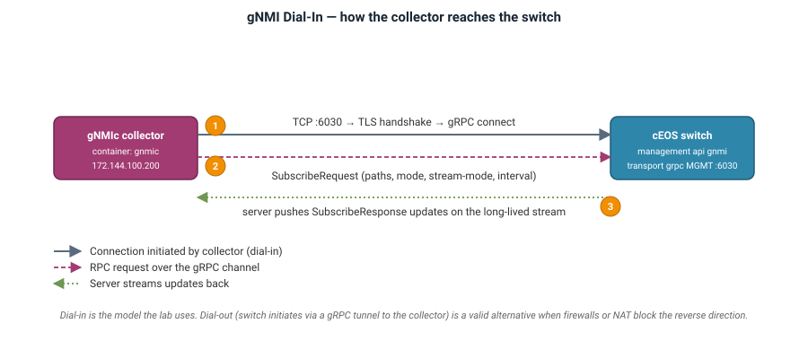

# **Telemetry Stack**

The three telemetry containers — `gnmic`, `prometheus`, `grafana` — share the lab's management network and form a linear pipeline. gNMIc subscribes to switches over gRPC on port 6030 and exposes reshaped metrics at `:9273/metrics`. Prometheus scrapes that endpoint every 5 seconds. Grafana queries Prometheus via PromQL for the pre-provisioned dashboards.

## **gNMIc Collector**

The gNMIc collector runs as a Linux container (`ghcr.io/openconfig/gnmic:latest`) on the management network at `172.144.100.200`. Its entire configuration is `clab/gnmic.yml`, mounted at `/gnmic.yml`. It follows the standard gNMI *dial-in* model — the collector initiates the gRPC connection to each switch, sends a `SubscribeRequest`, and receives updates on the long-lived stream.



### **Targets (gNMIc)**

Every leaf and spine is enumerated. The switches present self-signed gRPC certs; `insecure: true` disables verification for the lab.

```yaml
username: arista
password: arista
port: 6030
timeout: 10s
skip-verify: true
encoding: json_ietf

targets:
  spine1:
    insecure: true
  spine2:
    insecure: true
  pe11:
    insecure: true
  pe12:
    insecure: true
  pe21:
    insecure: true
  pe22:
    insecure: true
```

### **Subscriptions (gNMIc)**

17 subscriptions in total; each with an explicit `stream-mode` and `sample-interval`. Frequently-changing operational counters run at 5s; slower-moving inventory (hardware, boot-time, EOS image) at 60s. The complete list is in [Lab Environment → Telemetry subscriptions catalog](index.md#telemetry-subscriptions-catalog); a representative extract:

```yaml
subscriptions:
  bgp_neighbors:
    paths:
      - /network-instances/network-instance[name=default]/protocols/protocol[name=BGP]/bgp/neighbors
    mode: stream
    stream-mode: sample
    sample-interval: 5s

  intf_ctrs:
    paths:
      - /interfaces/interface[name=*]/state/counters
    mode: stream
    stream-mode: sample
    sample-interval: 5s

  intf_oper_state:
    paths:
      - /interfaces/interface[name=*]/state/oper-status
    mode: stream
    stream-mode: sample
    sample-interval: 5s

  isis_adjacencies:
    paths:
      - /network-instances/network-instance[name=default]/protocols/protocol[name=EVPN_UNDERLAY]/isis
    mode: stream
    stream-mode: sample
    sample-interval: 10s

  cpu_load_avg:
    paths:
      - eos_native:/Kernel/sysinfo
    mode: stream
    stream-mode: sample
    sample-interval: 5s
```

!!! note
    The `isis_adjacencies` subscription only returns data when the fabric was deployed with `-e underlay_routing_protocol=isis`. In the default eBGP-underlay build it silently returns nothing.

### **Event Processors (gNMIc)**

Prometheus requires numeric samples and cardinality-bounded labels. gNMIc's event processors run in sequence on each notification before it is exported. Five processors are wired into the `prom` output:

```yaml
processors:
  extract-vlan-id:
    event-extract-tags:
      value-names:
        - ".*vlanConfig/(?P<vlan_id>\\d+)/.*"
  eos-version:
    event-strings:
      value-names:
        - ".*version$"
        - ".*arch$"
      transforms:
        - replace:
            apply-on: "value"
            old: "EOS"
            new: "eos"
  trim-prefixes:
    event-strings:
      value-names:
        - ".*"
      transforms:
        - path-base:
            apply-on: "name"
  bounce-map:
    event-strings:
      value-names:
        - oper-status
        - admin-status
      transforms:
        - replace:
            apply-on: "value"
            old: "UP"
            new: "1"
        - replace:
            apply-on: "value"
            old: "DOWN"
            new: "0"
  drop-gr:
    event-delete:
      value-names:
        - ".*graceful-restart.*"
```

- `extract-vlan-id` promotes a VLAN id out of the path and into a Prometheus label so PromQL can group by VLAN.
- `eos-version` normalises the version string.
- `trim-prefixes` shortens the metric name to the leaf (`state/oper-status` → `oper_status`).
- `bounce-map` converts enum strings `UP`/`DOWN` to `1`/`0` so `oper-status` is queryable as a numeric time-series.
- `drop-gr` removes any leaf containing `graceful-restart` before `trim-prefixes` runs — otherwise multiple sibling `graceful-restart.*` leaves would collide on the same trimmed name and overwrite the `pfxRcd` counters with `0`.

### **Prometheus Output (gNMIc)**

```yaml
outputs:
  prom:
    type: prometheus
    listen: :9273
    path: /metrics
    metric-prefix: gnmic
    append-subscription-name: true
    strings-as-labels: true
    export-timestamps: true
    debug: false
    event-processors:
      - extract-vlan-id
      - drop-gr
      - trim-prefixes
      - bounce-map
      - eos-version
```

`append-subscription-name: true` gives every metric a `_subscription_name_` label so you can filter by which subscription produced it (e.g. `bgp_neighbors` vs `intf_oper_state`). `strings-as-labels: true` turns non-numeric leaves into labels rather than dropping them. Port 9273 is exposed inside the container network only — it is not published to the host.

## **Prometheus**

Time-series database. Scrapes gNMIc every 5 seconds, stores samples locally, serves PromQL queries to Grafana. UI at `http://<host>:9090`.

### **Scrape Configuration**

Prometheus scrapes the gNMIc `/metrics` endpoint every 5s. Only one target is configured; gNMIc itself fans out to all six switches.

```yaml
global:
  scrape_interval: 5s

scrape_configs:
  - job_name: "gnmic"
    static_configs:
      - targets: ["gnmic:9273"]
```

Prometheus runs as `prom/prometheus:v2.54.1` at `172.144.100.210`. Its UI is published to the host at `http://<host>:9090`.

### **Retention & Storage**

Default retention (15 days) and default TSDB path (`/prometheus`). The container is not backed by a persistent volume — restarting the lab clears the store, which is intentional for a lab environment.

## **Grafana**

Visualization layer. Runs as `grafana/grafana:11.2.0` at `172.144.100.220`, published to the host at `http://<host>:3001`. Anonymous Admin access is enabled so users can explore dashboards without logging in; the `arista/arista` credentials are honoured for panel editing.

### **Datasource Provisioning**

A single Prometheus datasource is provisioned from `clab/grafana/provisioning/datasources/`, pointing at `http://prometheus:9090`.

### **Dashboard Provisioning**

Dashboards are read from `clab/grafana/provisioning/dashboards/` on container start; the JSON files are the source of truth. Changes made in the Grafana UI live only until the container is restarted.

### **Dashboards Included**

| Dashboard | Focus | Key Metrics |
|---|---|---|
| `device-overview` | Per-device roll-up | CPU, memory, uptime, EOS version, interface count |
| `fabric-health` | Fabric-wide traffic light | BGP session states, interface admin/oper counts |
| `interface-stats` | Interface counters over time | `in-octets`/`out-octets`, errors, discards |
| `l3-telemetry` | Underlay + overlay routing | BGP received/installed prefixes per neighbor, IS-IS adjacency counts |
| `evpn-telemetry` | EVPN overlay | L2VPN-EVPN peer count/state, prefixes-installed, rejected routes, overlay peer flap count |


---

**Previous:** [← Fabric Configuration](fabric-configuration.md) &nbsp;·&nbsp; **Next:** [Exploring the Lab →](exploring-the-lab.md) &nbsp;·&nbsp; [Back to guide index](index.md)

--8<-- "gnmic-deployment-guide/_abbreviations.md"