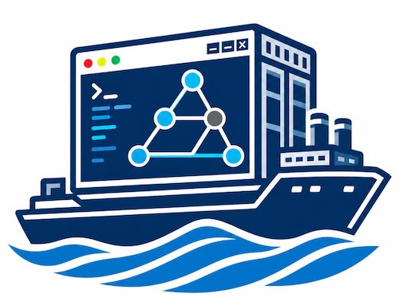

# Arista Community Labs

{ width="300" }

???+ info "🚧  Pardon our dust 🏗️"
    The Arista Community Labs repository is under active development with new labs, features, and functionality coming soon!

## What is a Community Lab?

Labs built by the Arista community, for the Arista community!

Whether refreshing one's skills, performing testing, or learning new technologies, protocols, features, and tools, building and maintaining the lab environments necessary to support these endeavors can be fraught with software dependencies and caveats.

Arista Community Labs reduce the burden of this task, with each lab environment built with three primary objectives:

-   :material-clock-fast:{ .lg .middle } __Ease of Consumption__

    ---

    Labs can be instantiated at any time with the click of a button.

-   :fontawesome-solid-person-running:{ .lg .middle } __Portability__

    ---

    The only local software requirement is a web browser.

-   :material-puzzle:{ .lg .middle } __Modularity__

    ---

    Nodes, image versions, and tools are easily modified over time.

The lab environments are pre-packaged with tools such as Ansible, Python, and the Arista [AVD](https://galaxy.ansible.com/ui/repo/published/arista/avd/).

Building acLabs would be much harder without following amazing projects:

- [Development Containers](https://containers.dev/)
- [Visual Studio Code](https://code.visualstudio.com/) and [Code Server](https://github.com/coder/code-server)
- Github and [Github Actions](https://github.com/features/actions), [Pages](https://docs.github.com/en/pages) and [Packages](https://docs.github.com/en/packages)
- [ContainerLab](https://containerlab.dev)[^2]

## The cArL Project

Arista Community Labs is part of a larger initiative called cArL (Containerized Arista Labs)

cArL foundational blocks are:

- [acLabs](https://aclabs.arista.com/) - portable [pre-build lab-base images](https://github.com/aristanetworks/aclabs/pkgs/container/aclabs%2Flab-base) and community lab collection
- [labs.arista](https://labs.arista.com/) - authentication, deeplink API and cloud backend

cArL foundation is further augmented by various content relying on it. For example:

- [AVD Playground](https://avd.arista.com/stable/ansible_collections/arista/avd/examples/index.html#avd-playground)
- [TechLibrary](https://tech-library.arista.com/) Labs

## How do I get started?

- Register on [arista.com](https://www.arista.com/)
- Go to any lab
- Click the link to start the lab and you will be redirected to [labs.arista](https://labs.arista.com/)
- Authenticate using you [arista.com](https://www.arista.com/) account and wait for the lab to be deployed

[^1]: This site uses the [Pexels](https://www.pexels.com/) royalty-free image library. Thank you to all Pexels authors and contributors!
[^2]: Containerlab is distributed under the [BSD-3 license](https://github.com/srl-labs/containerlab/blob/main/LICENSE).
