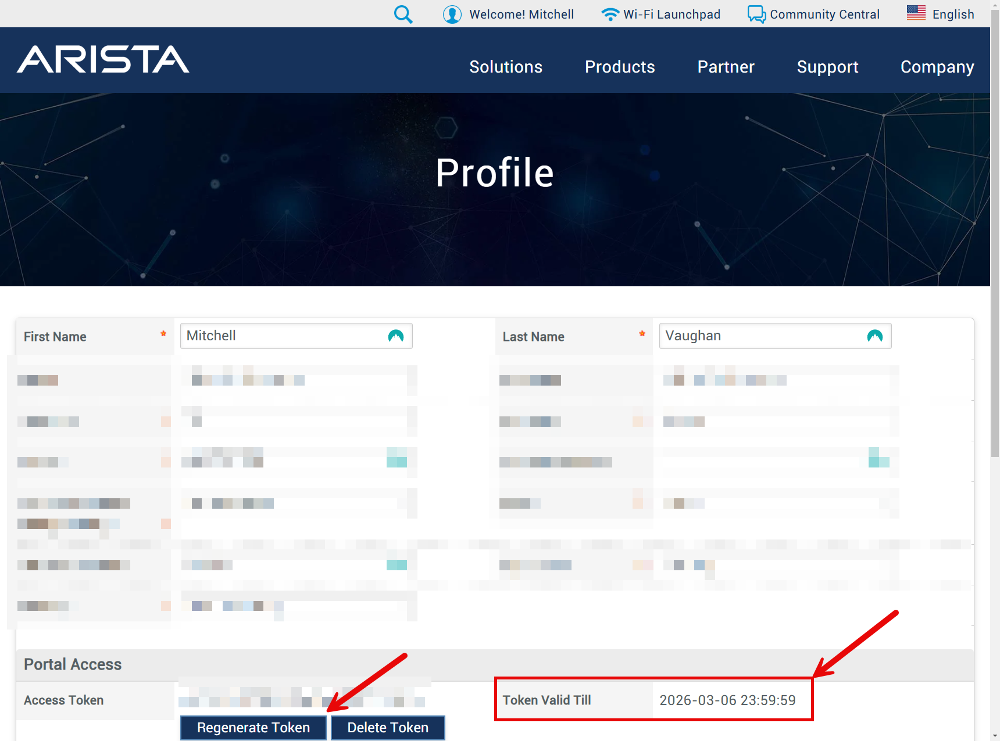
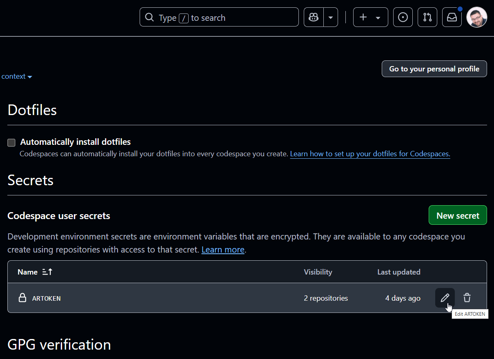
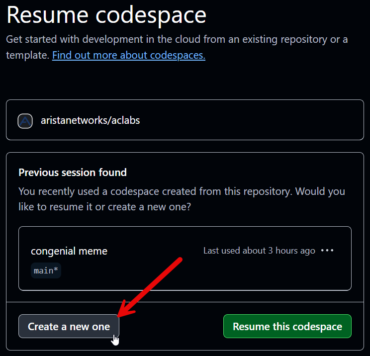
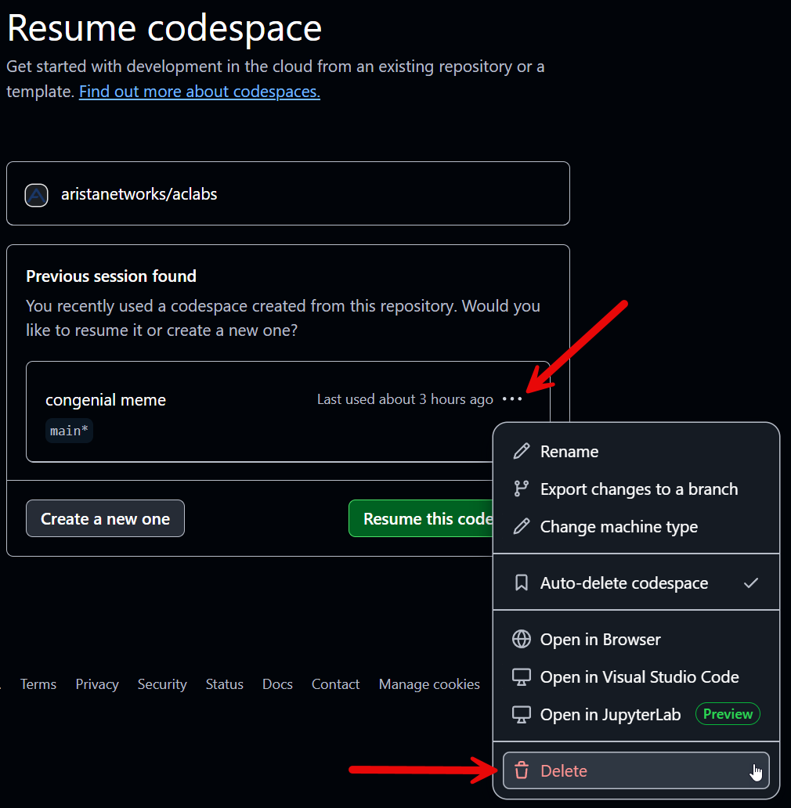
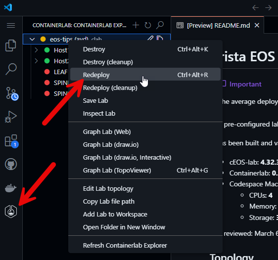
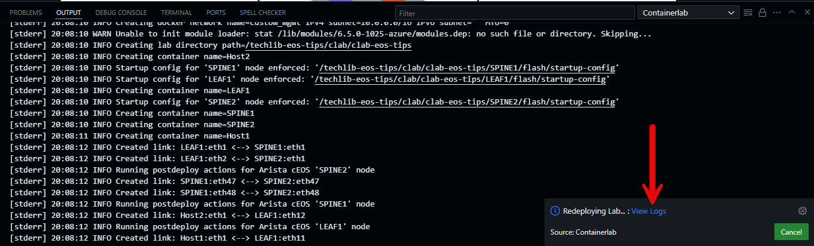

# Getting started with Arista Community Labs

This guide is intended for individuals looking to familiarize themselves with the steps necessary to get started with Arista Community Labs, powered by [GitHub Codespaces](https://github.com/features/codespaces/).

<div class="grid cards" markdown>

- :octicons-tasklist-16: [Pre-Requisites](#pre-requisites)
- :octicons-rocket-16: [Start the Lab](#starting-the-lab)
- :material-cursor-default-click: [Interact with the Lab](#interacting-with-the-lab)
- :fontawesome-regular-circle-stop: [Stop the Lab](#stopping-the-lab)
- :fontawesome-regular-circle-stop: [Tips and Troubleshooting](#tips-and-troubleshooting)

</div>

## Pre-Requisites

Before launching an Arista Community Lab, the following pre-requisites must be met:

<div class="annotate" markdown>

1. [Arista account](https://www.arista.com)(1) with the ability to download cEOS-lab via [Software Downloads](https://www.arista.com/en/support/software-download)
2. [GitHub account](https://github.com/signup)
3. [GitHub Codespaces Access](https://github.com/features/codespaces)(2)
4. [Arista user token](https://www.arista.com/en/users/profile)

</div>

1. Need an account? Register here! [Arista account registration](https://www.arista.com/en/user-registration).

    The email address used for the account must be associated with a corporate email domain (no Gmail, Yahoo, etc.).

2. For those that have never used Codespaces before, no worries! There is a quick primer on Codespaces included below!

We can find the user token by logging into [arista.com](https://www.arista.com) and selecting [My Profile](https://www.arista.com/en/users/profile).

The tabs below illustrate the steps needed to locate and copy the token:

=== "Login"
    <figure markdown>
    { width=700px }
    <figcaption>Arista - Login</figcaption>
    </figure>

=== "My Profile"
    <figure markdown>
    { width=700px }
    <figcaption>Arista - My Profile</figcaption>
    </figure>

=== "User Token"
    <figure markdown>
    { width=700px }
    <figcaption>Arista - User Token (Blurred) </figcaption>
    </figure>

??? question "What's with the token? :coin:"
    When an Arista Community Lab is started, the user token will be used to automatically download and import the necessary cEOS-lab image into the lab environment.

## GitHub Codespaces Primer

### Overview

GitHub Codespaces can instantiate a fully configured development or lab environment hosted on GitHub's cloud infrastructure with the click of a button.

Codespaces for Arista Community Labs are pre-packaged with tools such as Python, Ansible, and Ansible Galaxy Collections including [AVD](https://galaxy.ansible.com/ui/repo/published/arista/avd/), [CVP](https://galaxy.ansible.com/ui/repo/published/arista/cvp/), and [EOS](https://galaxy.ansible.com/ui/repo/published/arista/eos/).

[Docker in Docker](https://github.com/microsoft/vscode-dev-containers/blob/main/containers/docker-in-docker/README.md) in alignment with the [Dev Container Specification](https://containers.dev/implementors/spec/) makes all of this possible with Codespaces.

### Costs

GitHub Codespaces is a commercial offering from GitHub. As of October 2024, all GitHub users have 120 hours of Codespace time available for free each month.

By default, if all 120 hours are consumed and the [User's Spending Limit](https://github.com/settings/billing/spending_limit) for Codespaces is $0, then Codespace usage will stop and cannot continue until the hours are replenished the following month.

??? question "When and how would GitHub charge me for this?💰"
    A GitHub user will never be charged for Codespace usage by default. Codespaces will stop working until the hours are renewed the next month.

Users can define a [Payment Method](https://github.com/settings/billing/payment_information) and [Spending Limit](https://github.com/settings/billing/spending_limit) for Codespaces. Once defined, usage beyond 120 hours can continue as long as the spending limit is not exceeded. Once a defined spending limit has been reached, Codespace usage cannot continue until the next month.

Additional information can be found in [GitHub's Codespaces Billing Overivew Page](https://docs.github.com/en/billing/managing-billing-for-your-products/managing-billing-for-github-codespaces/about-billing-for-github-codespaces).

??? question "What if I forget about my Codespace? :scream:"
    Don't worry! It won't run forever, at least not by default.

    The `Default idle timeout` and `Default retention period` values can be modified within [GitHub Codespaces Settings](https://github.com/settings/codespaces).

    These parameters can be changed at any time, and should be defined with values that make the most sense for your usage patterns.

    A general recommendation for these values is provided below:

     - **Default idle timeout**: `30 Minutes`
     - **Default retention period**: `1 Day`

Codespaces can be deleted at anytime from the [Codespaces section of GitHub](https://github.com/codespaces).

### Machine Types

Different machine types are available within Codespaces. As a general rule, the greater the number of CPU cores, the greater number of hours that will be consumed during the Codespace's runtime.

[GitHub's Pricing for Paid Usage](https://docs.github.com/en/billing/managing-billing-for-your-products/managing-billing-for-github-codespaces/about-billing-for-github-codespaces#pricing-for-paid-usage) chart provides the details of the `usage multiplier` for each available machine type.

For example, as of the writing of this guide:

- :fontawesome-solid-microchip: `2 Core` Machine Types will consume `2` hours for every hour of runtime
- :fontawesome-solid-microchip: `8 Core` Machine Types will consume `8` hours for every hour of runtime
- :fontawesome-solid-microchip: `16 Core` Machine Types will consume `16` hours for every hour of runtime

Some Arista Community Labs make use of larger machine types, such as the :fontawesome-solid-microchip: `16 Core` option.

??? question "My GitHub Account doesn't have access to a larger :fontawesome-solid-microchip: `8 Core` or :fontawesome-solid-microchip: `16 Core` machine types?"
    By default, some larger machine types may not be available for use. In order to resolve this, a ticket can be opened via [GitHub support](https://support.github.com/contact?source=subtitle&tags=rr-general-technical) requesting access to these larger machine types.

    Listed below is a template that can be used for this request:

    ```yaml
    Hello - Can the 8-core and 16-core codespace machine types please be enabled for my account?
    The default 2-core and 4-core machines lack the necessary resources for my use cases.
    If additional information is needed, please let me know.
    Thanks!
    ```

    Once completed, select **Create a Ticket**

## Starting the Lab

!!! note
    All community labs hosted via Codespaces will follow a similar process to the one defined below. Labs that contain exceptions to the process below will have this specifically called out via a note associated with the lab launch button.

Once a lab has been launched via it's respective 'Start Lab' button, a `Create Codespace` window will be opened via a web browser:

<figure markdown>
{ width=500px }
<figcaption> Create a Codespace - Enter your Arista User Token </figcaption>
</figure>

In the `ARTOKEN` field, paste the user token copied from [your arista.com user profile](https://www.arista.com/en/users/profile).

This is a one time requirement, and will be saved for all subsequent Arista Community Lab deployments.

??? question "Where is the token saved? :thinking:"
    Once entered, the token is saved as a GitHub Codespaces `Secret`. This can be viewed via the [Codespaces section of GitHub account settings](https://github.com/settings/codespaces).

    <figure markdown>
    { width=500px }
    <figcaption> Codespaces Secrets </figcaption>
    </figure>

??? note "Watch the expiration date! :hourglass_flowing_sand:"
    User tokens on arista.com have an expiration date listed in the `Token Valid Till` field in the `Portal Access` section of the user profile.

    If the token has expired, click Regenerate Token to create a new one. A token expires one year after it was generated; the user cannot modify this value.

Once the token has been entered, and `Create new Codespace` has been selected, a new tab will open in the browser containing the codespace

??? question "Wait...the codespace opened in my local VS Code!"
    Not a problem! This just means that VS Code is locally installed and `Visual Studio Code` is selected in the `Editor preference` section of the [GitHub account's Codespaces settings](https://github.com/settings/codespaces).

In the newly launched Codespace, a tab is opened displaying an overview of the lab.

The `Post Deploy Script` can be seen running in the terminal, and will take between five and nine minutes to complete depending on the size of the lab.

<figure markdown>
{ width=800px }
<figcaption>Post Deploy Script Running (Click to Zoom)</figcaption>
</figure>

!!! note "Grab a coffee! :coffee:"
    The post deployment script can take a few minutes to run. Grab a coffee while the lab environment is being created.

Once the post deployment script has completed, the terminal prompt will change to the GitHub username followed by the name of the lab.

In the screenshot below, the GitHub username is `MitchV85` and the lab is `techlib-vxlan-domain-a`.

<figure markdown>
{ width=800px }
<figcaption>Post Deploy Script Complete (Click to Zoom)</figcaption>
</figure>

At this point, the lab is ready to go! Running the following command in the terminal will provide an overview and status of all deployed nodes:

```bash
make inspect
```

<figure markdown>
{ width=800px }
<figcaption>Lab Status Output (Click to Zoom)</figcaption>
</figure>

## Interacting with the Lab

Once the lab is up and running, we can interact with the topology nodes.

Both SSH and API access to the nodes are available via the Codespace. Lab environments are pre-packaged with tools like Python and the Arista [AVD](https://galaxy.ansible.com/ui/repo/published/arista/avd/), [CVP](https://galaxy.ansible.com/ui/repo/published/arista/cvp/), and [EOS](https://galaxy.ansible.com/ui/repo/published/arista/eos/) Ansible Galaxy collections.

Labs that leverage tools such as AVD for configuration, documentation, and testing will provide the instructions in their lab guide.

Accessing the environment via SSH is detailed below:

### SSH

??? tip "More real estate for those SSH sessions 🏠"
    Increase the size of the terminal by selecting the `Maximize Panel Size` button to the right of the terminal:

    <figure markdown>
    { width=800px }
    <figcaption>Maximize the Terminal (Click to Zoom)</figcaption>
    </figure>

A list of `Lab Hosts` that are accessible via `SSH` from within the codespace can be viewed at any time from the terminal by entering the following command:

```bash
make inspect
```

To access a node, use the `ssh` command followed by `admin@hostname` as shown in the example below

```bash
ssh admin@A-SPINE1
```

??? question "What's the password? :lock:"
    The credentials used to access nodes within an Arista Community Lab environment will always be listed in the lab's documentation.

??? tip "Use tabs 📑"
    Create a new tab for an SSH session by selecting `New Terminal` to the right of the terminal.

    Alternatively, the following keyboard shortcut can be used to open a new tab on both Windows and macOS: ++ctrl+shift+single-quote++

    Once opened, the new terminal tab can be renamed by right-clicking on the tab and selecting `Rename`

    === "New Terminal"
        <figure markdown>
        { width=800px }
        <figcaption>New Terminal Tab (Click to Zoom)</figcaption>
        </figure>

    === "Rename the Tab"
        <figure markdown>
        { width=800px }
        <figcaption>Rename the Terminal Tab (Click to Zoom)</figcaption>
        </figure>

    === "Renamed Tabs 🎉"
        <figure markdown>
        { width=800px }
        <figcaption>Rename the Terminal Tab (Click to Zoom)</figcaption>
        </figure>

## Stopping the Lab

When you're finished with the lab, simply close the codespace by exiting the browser window. By default, a GitHub Codespace is stopped after 45 minutes of idleness and deleted after 30 days of inactivity.

??? tip "Conserve those hours and save some money! 💵💷💶💴"
    The `Default idle timeout` and `Default retention period` values can be modified within [GitHub Codespaces Settings](https://github.com/settings/codespaces).

    These parameters can be changed at any time, and should be defined with values that make the most sense for your usage patterns.

    A general recommendation for these values is provided below:

     - **Default idle timeout**: `30 Minutes`
     - **Default retention period**: `1 Day`

A list of all codespaces can be found in the [Codespaces section of GitHub](https://github.com/codespaces). From here, a codespace can be resumed, stopped, deleted, renamed, and more!

## Tips and Troubleshooting

### Tip 1 - 'docker login': denied

During the initial lab provisioning, the user's [Arista Access Token](https://www.arista.com/en/users/profile) is used to download cEOS-lab into the Codespace and import it into Docker.

In the event that the user's Arista Access Token has expired, or is not present, the lab will fail to download cEOS-lab from [arista.com](https://www.arista.com/en/support/software-download) and attempt to download the cEOS-lab image from DockerHub.

When this happens, the lab terminal will display the following message:

```bash
Error: Error response from daemon: pull access denied for arista/ceos, repository does not exist or may require 'docker login': denied: requested access to the resource is denied
make: *** [Makefile:9: start] Error 1
```

!!! success "Solution - Update ARTOKEN with new token :arrow_down:"

When a token is created in a user's [arista.com profile](https://www.arista.com/en/users/profile), it is valid for one year.

Follow the steps below to generate a new token and update the `ARTOKEN` secret used by acLabs Codespaces.

- Open your [arista.com user profile](https://www.arista.com/en/users/profile)

- Choose `Regenerate Token`

{ width=600px }

- Copy the token

<div class="annotate" markdown>

- Update the `ARTOKEN` value in your [GitHub Codespaces Settings](https://github.com/settings/codespaces)(1)

</div>

1. :pencil2: In the event that the `ARTOKEN` secret doesn't exist in your [GitHub Codespaces Settings](https://github.com/settings/codespaces), choose `New secret` and create it.

    This value is created automatically the first time an acLabs lab is launched, but in rare situations this auto-creation may not occur.

{ width=600px }

Once updated, launch a new acLab(1) and get back to labbing! :lab_coat:
{ .annotate }

1. :pencil2: It's recommended to delete the Codespace where the failure occurred, and instead create a new one by choosing `Create a new one` when prompted to resume the failed Codespace
    { width=600px }

### Tip 2 - Resuming an acLab

By default, GitHub Codespaces will automatically shutdown(1) after 30 minutes, and will be deleted(2) after 30 days of inactivity.
{ .annotate }

1. :pencil2: Default idle timeout
2. :pencil2: Default retention period

These `Default idle timeout` and `Default retention period` parameters can be changed at any time within [GitHub Codespaces Settings](https://github.com/settings/codespaces).

A general recommendation for these values is provided below:

- **Default idle timeout**: `30 Minutes`
- **Default retention period**: `1 Day`

!!! tip "How to resume an acLab :arrow_down:"

If the `Default idle timeout` has been reached, then a user may find themselves presented with the following message when re-launching the lab:

{ width=600px }

Multiple choices exist at the above prompt:

<div class="annotate" markdown>

1. Create a new instance of the lab in a new Codespace (1)
2. Resume an existing lab that was shutdown due to the idle timeout being reached
3. Delete the existing codespace(2)

</div>

1. Disregard the remainder of this section and jump into the lab! :smile:
2. 

Select `Resume this codespace` to bring the codespace back up.

Once the Codespace is ready(1) the lab can be resumed via the ContainerLab extension by right-clicking the lab name and selecting `Redeploy`
{ .annotate }

1. If the terminal is open and responsive, the Codespace is back up and running!



After selecting `Redeploy`, the terminal will present a message indicating that ContainerLab is in the process of redeploying the lab.

If desired, select `View Logs` to monitor the process of the lab as it is started back up.



When complete, a message indicating success will be presented and it's time to jump back into the lab! :partying_face:

## :test_tube: Happy labbing! :test_tube:
