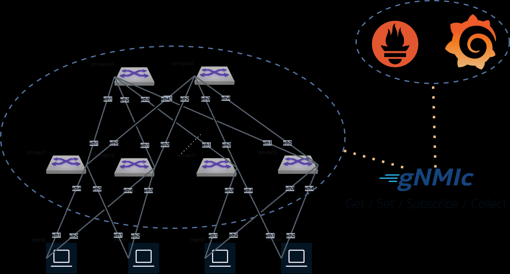
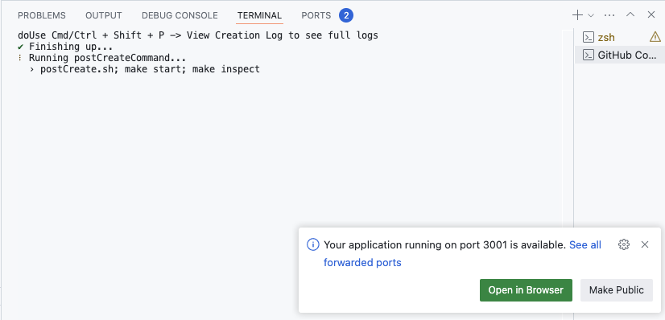
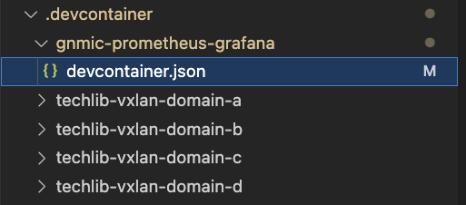
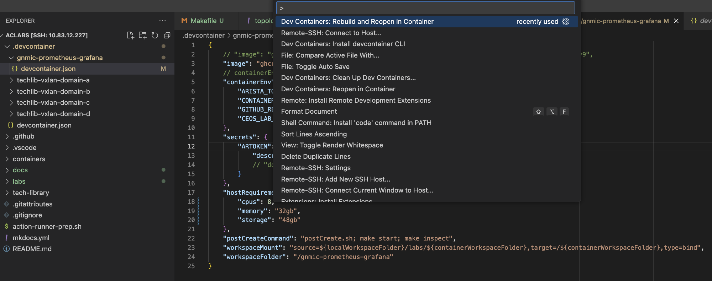
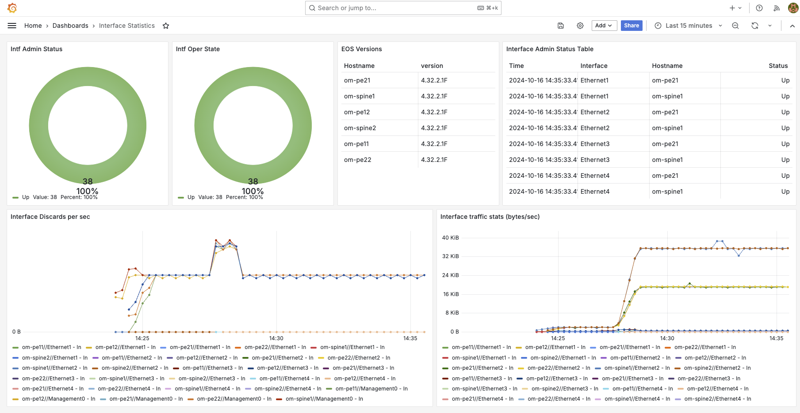
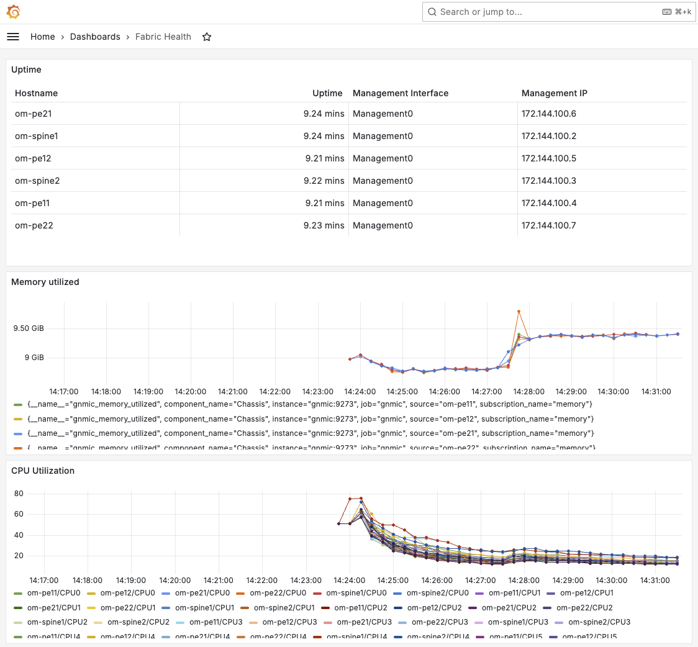
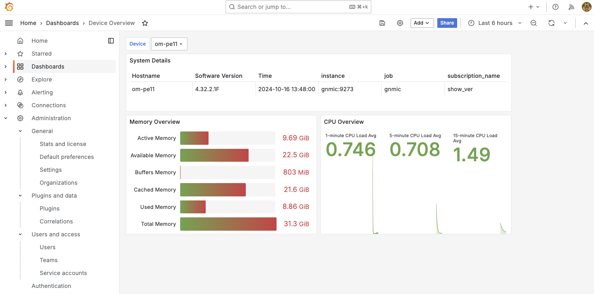
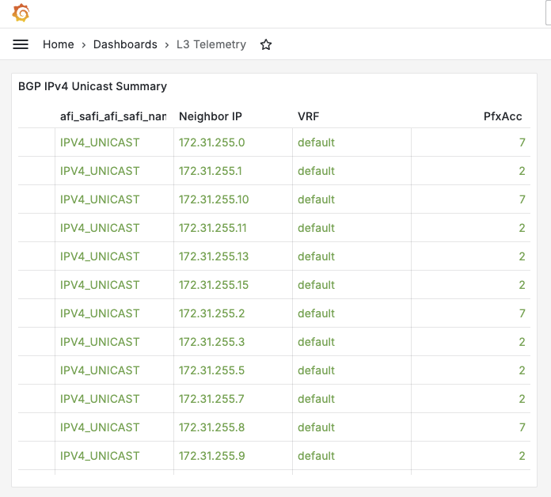

# Telemetry labs

???+ info "How to run this lab?"

    Please read the [Quickstart guide](https://aclabs.arista.com/quickstart/)!

## gNMIc Prometheus Grafana Lab

### Lab Topology



### Demo Details

!!! Warning "Container Requirements"

    CPUs: 16
    Memory: 64 GB
    Storage: 64 GB

### Run it in Codespaces

[Start :octicons-play-16: gNMIc-Prometheus-Grafana Lab :octicons-mark-github-24:](https://codespaces.new/aristanetworks/aclabs/tree/main?quickstart=1&devcontainer_path=.devcontainer%2Fgnmic-prometheus-grafana%2Fdevcontainer.json){ .md-button .md-button--primary target=_blank}

To run the lab on your own machine, you can download all required files using the button below.

[Download all required lab files](https://{{gh.org_name}}.github.io/aclabs/lab_archives/gnmic-prometheus-grafana.tar.gz){ .md-button .md-button--primary target=_blank}

!!! Note

    The ARTOKEN variable should be set for the scripts to be able to download the cEOS-lab image. Please set this before clicking on `Create new codespace` as mentioned in the [Quickstart](quickstart.md#starting-the-lab)

Once the web based vscode starts the containerlab topology should be automatically deployed via the `postCreate.sh` script, and once the grafana container is ready, Codespaces will send a notification and reveal the `Open in Browser` button.



To access Grafana use the `arista/arista` credentials.

To add configurations to the switches, such as configuring EVPN, we can use AVD for instance (This will be needed for the L3 Telemetry dashboard):

  ```bash
  ansible-playbook playbooks/fabric-deploy-config.yaml -i inventory.yaml
  ```

### How To Run The Lab on Your Machine

It is possible to run the lab on your local machine (or any server) instead of using Github Codespaces.
However you must take care of you VSCode setup and setting up environment variables. Also keep in mind that auto-downloaded image will not work on ARM-based MacBooks (yet).


0. SSH to your server and make sure docker and git are installed and the env vars are set (see [Appendix](#Appendix) section).

1. git clone the project

  ```bash
  git clone https://github.com/aristanetworks/aclabs.git
  ```

2. Open the project directory in vscode

  ```bash
  cd aclabs
  code .
  ```

  or if you started VScode manually, then make sure to load only the workspace directory of the cloned repo,
  ie `aclabs` folder in this case, otherwise devcontainer container build process will get stuck in deployment phase.

3. Select the `devcontainer.json` file

  

4. Bring up the command pallette in vscode e.g. by pressing `CTRL+SHIFT+P` and select or search for `Dev Containers: Reopen in Container` or `Dev Containers: Rebuild and Reopen in Container`

  

5. Deploy containerlab topology

  ```bash
  make start
  ```

  !!! Tip

      If any of the image downloads timeout you may try rerunning the `make start` command.

  If everything goes well you should see something like below at the end:

  ```bash
  +----+--------------------+--------------+--------------------------------------------------+-------+---------+--------------------+--------------+
  | #  |        Name        | Container ID |                      Image                       | Kind  |  State  |    IPv4 Address    | IPv6 Address |
  +----+--------------------+--------------+--------------------------------------------------+-------+---------+--------------------+--------------+
  |  1 | clab-om-client1    | 9e0305c8a828 | ghcr.io/aristanetworks/aclabs/host-ubuntu:rev1.0 | linux | running | 172.144.100.8/24   | N/A          |
  |  2 | clab-om-client2    | 52cf2aef8ebe | ghcr.io/aristanetworks/aclabs/host-ubuntu:rev1.0 | linux | running | 172.144.100.9/24   | N/A          |
  |  3 | clab-om-client3    | c0b50717f247 | ghcr.io/aristanetworks/aclabs/host-ubuntu:rev1.0 | linux | running | 172.144.100.10/24  | N/A          |
  |  4 | clab-om-client4    | 14e93f835555 | ghcr.io/aristanetworks/aclabs/host-ubuntu:rev1.0 | linux | running | 172.144.100.11/24  | N/A          |
  |  5 | clab-om-gnmic      | b61e380ef683 | ghcr.io/openconfig/gnmic:0.38.2                  | linux | running | 172.144.100.200/24 | N/A          |
  |  6 | clab-om-grafana    | c63aa0b25582 | grafana/grafana:11.2.0                           | linux | running | 172.144.100.220/24 | N/A          |
  |  7 | clab-om-om-pe11    | 5140b4c79e6d | arista/ceos:4.32.2.1F                            | ceos  | running | 172.144.100.4/24   | N/A          |
  |  8 | clab-om-om-pe12    | 0457268e8a1b | arista/ceos:4.32.2.1F                            | ceos  | running | 172.144.100.5/24   | N/A          |
  |  9 | clab-om-om-pe21    | e4ddbd8f052c | arista/ceos:4.32.2.1F                            | ceos  | running | 172.144.100.6/24   | N/A          |
  | 10 | clab-om-om-pe22    | db67714e6e6c | arista/ceos:4.32.2.1F                            | ceos  | running | 172.144.100.7/24   | N/A          |
  | 11 | clab-om-om-spine1  | fbe81fcf3207 | arista/ceos:4.32.2.1F                            | ceos  | running | 172.144.100.2/24   | N/A          |
  | 12 | clab-om-om-spine2  | 4880915b2d8c | arista/ceos:4.32.2.1F                            | ceos  | running | 172.144.100.3/24   | N/A          |
  | 13 | clab-om-prometheus | 6b205dbcdfcb | prom/prometheus:v2.54.1                          | linux | running | 172.144.100.210/24 | N/A          |
  +----+--------------------+--------------+--------------------------------------------------+-------+---------+--------------------+--------------+
  ```

6. Access Grafana on your laptop by going to [localhost:3001](http://localhost:3001) (arista/arista)

  

  

  

7. To add configurations to the switches, such as configuring EVPN, we can use AVD for instance:

  ```bash
  ansible-playbook playbooks/fabric-deploy-config.yaml -i inventory.yaml
  ```

  After that the L3 Telemetry dashboard should populate as well:

  

### Lab details

Looking at the [gnmic.yml file](../labs/gnmic-prometheus-grafana/clab/gnmic.yml) we can see that we're going to use `gnmic` to subscribe to several OpenConfig and EOS native paths
and write the data into Prometheus either in their raw states or modifying them
with [processors](https://gnmic.openconfig.net/user_guide/event_processors/intro/), which
are needed due to Prometheus only accepting numerical values.

For additional paths please check the [EOS Path report](https://www.arista.com/en/support/toi/path-support).

## Appendix

### Configure environment variables

Add the env vars to your `~/.bashrc` or `~/.zshrc`

```shell
export ARTOKEN="INSERT arista.com token"
export GITHUB_REPOSITORY="aristanetworks/aclabs"
```

`ARTOKEN` is needed so that the cEOS-lab image can be auto-downloaded from arista.com. This can be generated from the [My Profile](https://www.arista.com/en/users/profile)
 page.

### Setup Docker on the Host

> Check if Docker is already installed. In this case you can skip the steps below.

1. Install Docker on the host. The detailed instructions are available [here](https://docs.docker.com/engine/install/ubuntu/). You can used one-liner script for that.
2. Add your user to the `docker` group.
3. Logout and login again to apply the changes.
4. Check the Docker version and run `hello-world` container to test functionality.
5. You must be able to run `docker` commands without `sudo` if it was installed correctly.

```bash
# install Docker
sudo curl -fsSL https://get.docker.com | sh
# add user to the docker group
sudo usermod -aG docker ${USER}
# test docker
docker --version
docker run hello-world
```

> **NOTE**: If you are running this workshop in Codespace or provided dev container, Docker is pre-installed. As the workshop magic happens inside a container in this case, we rely on Docker-in-Docker concept to provide required functionality.

### Setup Git (Optional)

- Git must be pre-installed on a Linux system. Otherwise you are in a wrong place. Escape! 👾 🚀
- Setup your name and email address:

  ```bash
  git config --global user.name "<first-and-2nd-name>"
  git config --global user.email "<your-email>"
  ```

- Check the current configuration:

  ```bash
  git config --list
  ```

> **NOTE**: On Codespace Git is pre-installed and pre-configured.

