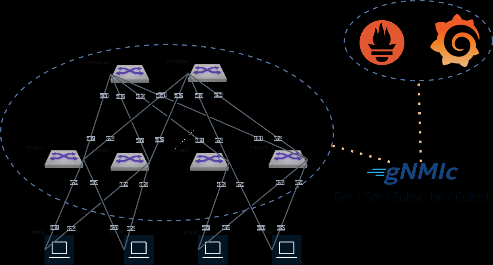

# Telemetry labs

## gNMIc Prometheus Grafana Lab

!!! Info "Lab Details"

    :fontawesome-solid-tag: **AVD Version:** 5.7.2<br>
    :fontawesome-solid-network-wired: **cEOS-lab:** 4.34.2F  
    :fontawesome-solid-flask: **Containerlab:** 0.72.0<br>

    

## How To Run The Lab

Arista Community Lab runs in a cloud-based lab environment sponsored by Arista [^1]. To get started, sign in at [labs.arista.com](https://labs.arista.com/) and click the button below to launch the lab.

[Start the lab :octicons-play-16:](https://labs.arista.com/launch?lab_type=gnmic-prometheus-grafana&origin=tech-lib){ .md-button .md-button--primary target=_blank}

All lab files are also available for [download](https://{{gh.org_name}}.github.io/{{gh.repo_name}}/lab_archives/gnmic-prometheus-grafana.tar.gz) if you want to run the lab on your own machine :material-information-outline:{ title="When deploying on ARM host - use cEOS-lab ARM image!" }. This option is intended for experienced users who can manage the environment without extra support.

To access Grafana use the `arista/arista` credentials.

To add configurations to the switches, such as configuring EVPN, we can use AVD for instance (This will be needed for the L3 Telemetry dashboard):

  ```bash
  ansible-playbook playbooks/fabric-deploy-config.yaml -i inventory.yaml
  ```

### Lab details

Looking at the [gnmic.yml file](../labs/gnmic-prometheus-grafana/clab/gnmic.yml) we can see that we're going to use `gnmic` to subscribe to several OpenConfig and EOS native paths
and write the data into Prometheus either in their raw states or modifying them
with [processors](https://gnmic.openconfig.net/user_guide/event_processors/intro/), which
are needed due to Prometheus only accepting numerical values.

For additional paths please check the [EOS Path report](https://www.arista.com/en/support/toi/path-support).

[^1]: GitHub Codespaces support was removed due to platform restrictions. Use labs.arista.com instead; it is available to all users with an arista.com account.
