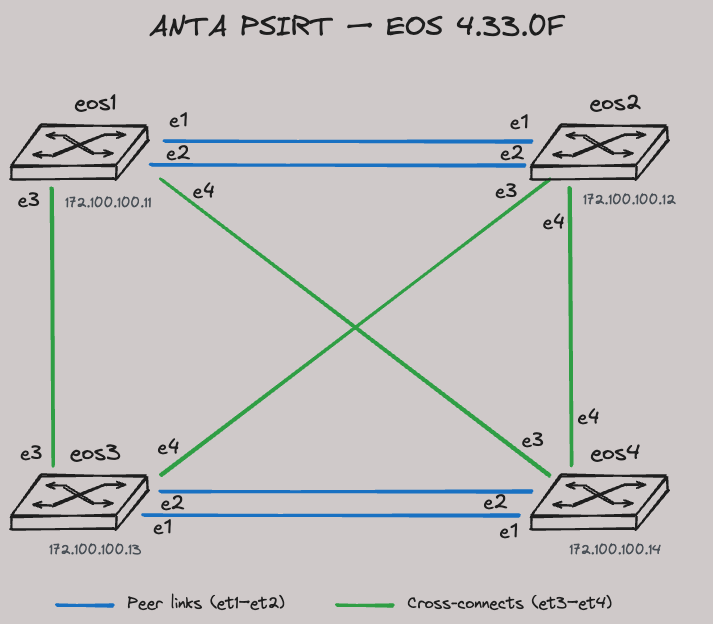

# ANTA PSIRT Lab

This lab provides four Arista cEOS switches running EOS 4.33.0F for ANTA and
PSIRT exercises. The ANTA inventory is available at `inventory.yml` in the lab
root.

## Topology

The `eos1`/`eos2` and `eos3`/`eos4` pairs each have two links. Four additional
links fully cross-connect the two pairs.



## Running ANTA

Open a terminal by clicking the three horizontal lines on the top left, select "Terminal" and then click "New Terminal".


Run ANTA PSIRT assessment and build a markdown report.

```shell
# Runs `anta psirt --ignore-error --ignore-status --username $(ANTA_USERNAME) --password $(ANTA_PASSWORD) --inventory inventory.yml md-report --md-output psirt-report.md`
make psirt-report
```

Run ANTA PSIRT assessment and build a CSV report.

```shell
# Runs `anta psirt --ignore-error --ignore-status --username $(ANTA_USERNAME) --password $(ANTA_PASSWORD) --inventory inventory.yml csv --csv-output psirt-report.csv`
make psirt-csv
```

## Credentials

- Username: `arista`
- Password: `arista`

## Other Commands

```shell
make start
make inspect
make stop
```
