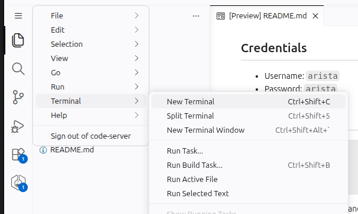

# ANTA Security Advisory Tests Lab

This lab provides four Arista cEOS switches running EOS 4.33.0F for ANTA SAT exercises.
The ANTA inventory is available at `inventory.yml` in the lab
root.

## Topology

The `eos1`/`eos2` and `eos3`/`eos4` pairs each have two links. Four additional
links fully cross-connect the two pairs.


## Running ANTA

Open a terminal by clicking the three horizontal lines on the top left, select "Terminal" and then click "New Terminal".



Run ANTA security advisory tests and build a markdown report.

```shell
# Runs `anta sat --ignore-error --ignore-status --username $(ANTA_USERNAME) --password $(ANTA_PASSWORD) --inventory inventory.yml md-report --md-output sat-report.md`
make sat-report
```

Run ANTA security advisory tests and build an expanded markdown report.

```shell
# Runs `anta sat --ignore-error --ignore-status --username $(ANTA_USERNAME) --password $(ANTA_PASSWORD) --inventory inventory.yml md-report --md-output sat-report-expanded.md` --expand
make sat-report-expanded
```

Run ANTA security advisory tests and build a CSV report.

```shell
# Runs `anta sat --ignore-error --ignore-status --username $(ANTA_USERNAME) --password $(ANTA_PASSWORD) --inventory inventory.yml csv --csv-output sat-report.csv`
make sat-csv
```

## Credentials

- Username: `arista`
- Password: `arista`

## Other Commands

```shell
make start
make inspect
make stop
```
