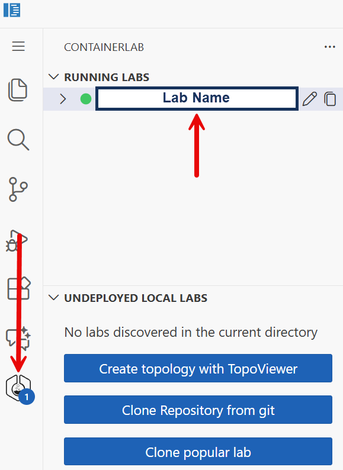

# Welcome to the UCN Sandbox Lab!

> [!WARNING]
> This lab is in preview. It's fully functional, but breaking changes can happen.
> We are working hard on building the best lab collection and your feedback is always appreciated.

> [!TIP]
> First time here or just need a refresher?
> Check out the [UCN Sandbox Lab overview video!](https://youtu.be/_YxHMcES0o4)

This lab is pre-packaged with:

- cEOS-lab: **4.35.2F**
- AVD: **5.7.3**
- Containerlab: **0.74.0**
- Resources:
  - CPUs: **16**
  - Memory: **64 GB**
  - Storage: **64 GB**

### Credentials

All cEOS and Linux nodes use the following credentials:

#### Username
```bash
admin
```

#### Password

```bash
admin
```

> [!TIP]
> The [ContainerLab VS Code Extension](https://containerlab.dev/manual/vsc-extension/) is pre-installed in the lab. For the best experience, it's recommended to use the [Topology Viewer](https://containerlab.dev/manual/vsc-extension/#topoviewer) to interact with the lab.
>
> Topology Viewer can be opened by selecting the ContainerLab extension icon and then the lab.

<figure>
    
</figure>

### SSH

Once in the Topology viewer, SSH to a node by right-clicking it and selecting `SSH`. This will open up a new terminal window containing the SSH session to the node.

<figure>
    
</figure>

### Packet Capture

Start a data-plane packet capture by right-clicking on a link and selecting the Wireshark icon associated with the link you'd like to capture

<figure>
    
</figure>

Additional information related to navigating the Topology Viewer UI can be found by selecting the `Shortcuts` icon from within the UI

<figure>
    
</figure>

Spin up a topology, or create your own!

Happy Labbing! 🥳🧪

Last reviewed: March 12th, 2026
