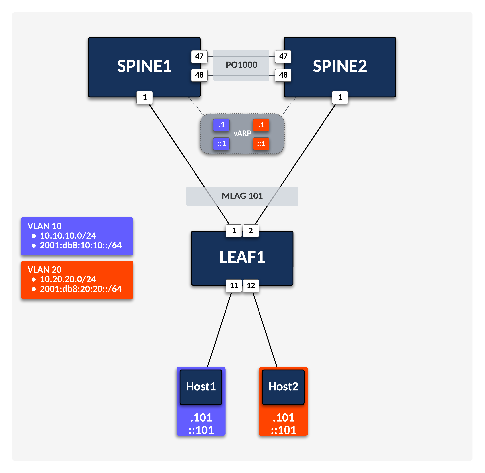
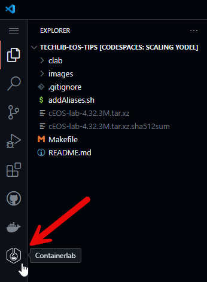

# Arista EOS Tips for Network Operators

This lab is intended to be used as a sandbox companion to the [EOS Tips for Network Operators Guide](https://tech-library.arista.com/eos/eos_ops/) in [Arista's Tech Library](https://tech-library.arista.com/).

This lab is tested for:

- cEOS-lab: **4.32.3M**
- Containerlab: **0.65.1**
- Codespace Machine Type:
  - CPUs: **4**
  - Memory: **16 GB**
  - Storage: **32 GB**

Last reviewed: March 6th, 2025

## Topology

## Credentials

Username: admin

Password: admin

## Accessing the Lab

Accessing the nodes in the topology is accomplished via the ContainerLab VSCode Extension.

Begin by opening the extension by clicking the icon found on the lefthand side of the Codespace:

Once opened, expand the topology by using the dropdown button next to the topology name:

Next, right-click on any node in the topology and select `Connect to SSH`

A new terminal tab will be opened, with a prompt requesting the password for the node. Enter `admin` to connect:

Happy Labbing!
