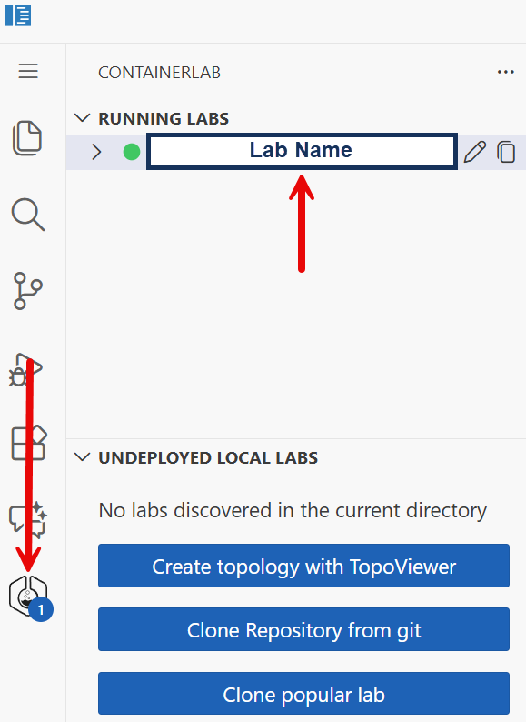
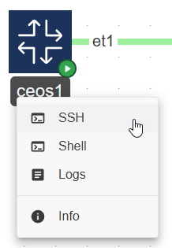
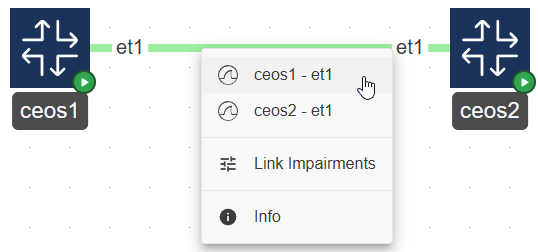
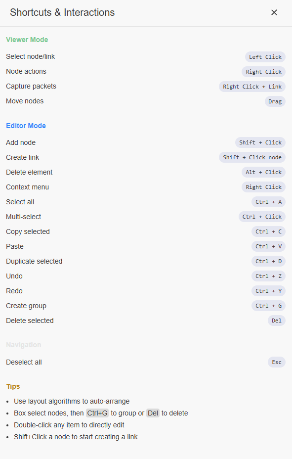

<!-- lab-dashboard:metadata-start -->

<!-- lab-dashboard:metadata-end -->

## Interacting with the Lab

> [!TIP]
> Quickly validate reachability between hosts in the lab by opening an SSH session to any Linux end host in the topology and running the following the command in the terminal window:
>
> ```bash
>pingcheck.sh
>```

### Topology Viewer

The [ContainerLab VS Code Extension](https://containerlab.dev/manual/vsc-extension/) is pre-installed in the lab. For the best experience, it's recommended to use the [Topology Viewer](https://containerlab.dev/manual/vsc-extension/#topoviewer) to interact with the lab.

Topology Viewer can be opened by selecting the ContainerLab extension icon and then the lab.

<figure>
    
</figure>

### SSH

Once in the Topology viewer, SSH to a node by right-clicking it and selecting `SSH`. This will open up a new terminal window containing the SSH session to the node.

<figure>
    
</figure>

### Packet Capture

Start a data-plane packet capture by right-clicking on a link and selecting the Wireshark icon associated with the link you'd like to capture

<figure>
    
</figure>

Additional information related to navigating the Topology Viewer UI can be found by selecting the `Shortcuts` icon from within the UI

<figure>
    
</figure>

Happy Labbing! 🥳🧪

Last reviewed: September 13th, 2026
