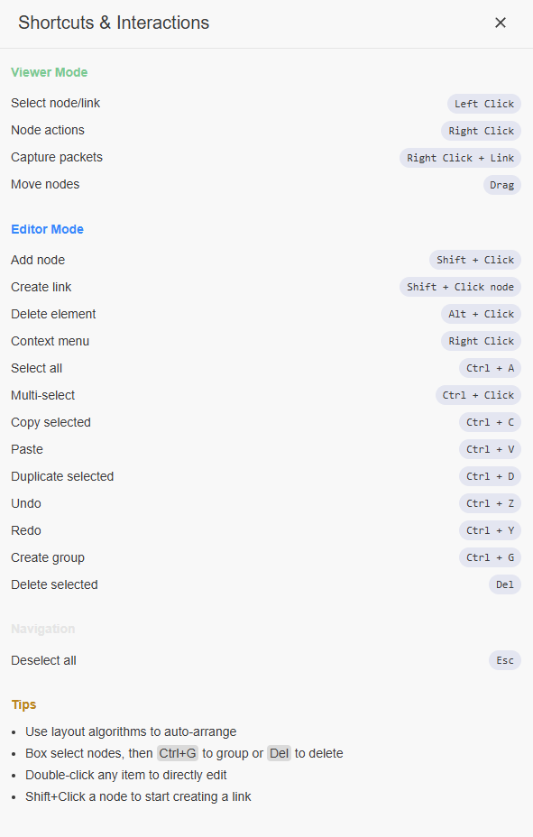

<!-- markdownlint-disable MD028 -->

# Arista RCF QuickStart Guide Lab

Welcome! This pre-configured lab is based on the scenarios defined in the [RCF QuickStart Solution Guide](https://tech-library.arista.com/solution_guides/rcf_quickstart/) found in [Arista's Tech Library](https://tech-library.arista.com/).

This lab has been validated with:

- cEOS-lab: **4.35.0F**
- Containerlab: **0.71.1**
- Resources:
  - CPUs: **8**
  - Memory: **32 GB**
  - Storage: **64 GB**

> [!IMPORTANT]
> The average deployment time for this lab is five minutes.
>
> Issue the `make inspect` command at the terminal to check on the deployment status of the lab.
>
> Please wait until all nodes are in a `running` state prior to interacting with the lab.

## Interacting with the Lab

### Credentials

Username: `admin`

Password: `admin`

> [!TIP]
> The [ContainerLab VS Code Extension](https://containerlab.dev/manual/vsc-extension/) is pre-installed in the lab. For the best experience, it's recommended to use the [Topology Viewer](https://containerlab.dev/manual/vsc-extension/#topoviewer) to interact with the lab.
>
> Topology Viewer can be opened by selecting the ContainerLab extension icon and then the lab.

<figure>
    
</figure>

### SSH

Once in the Topology viewer, SSH to a node by right-clicking it and selecting `SSH`. This will open up a new terminal window containing the SSH session to the node.

<figure>
    
</figure>

### Packet Capture

Start a data-plane packet capture by right-clicking on a link and selecting the Wireshark icon associated with the link you'd like to capture

<figure>
    
</figure>

Additional information related to navigating the Topology Viewer UI can be found by selecting the `Shortcuts` icon from within the UI

<figure>
    
</figure>

Happy Labbing! 🥳🧪

Last reviewed: November 19th, 2025
