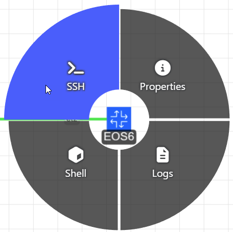

# Arista's Tech Library EVPN-VXLAN Domain D Lab

Welcome! This pre-configured lab matches the [Domain D topology in the EVPN-VXLAN Deployment Guide](https://tech-library.arista.com/data_center/evpnvxlan/deployment_guide/domain_d/) on [Arista's Tech Library](https://arista.com/en/tech-library).

## Overview

This lab has been validated with:

- cEOS-lab: **4.35.1F**
- Containerlab: **0.72.0**
- Resources:
  - CPUs: **16**
  - Memory: **64 GB**
  - Storage: **64 GB**

> [!IMPORTANT]
> The average deployment time for this lab is ten minutes.
>
> Issue the `make inspect` command at the terminal to check on the deployment status of the lab.
>
> Please wait until all nodes are in a `running` state prior to interacting with the lab.

## Interacting with the Lab

### Credentials

#### Username
```bash
admin
```

#### Password

```bash
admin
```

> [!TIP]
> The [ContainerLab VS Code Extension](https://containerlab.dev/manual/vsc-extension/) is pre-installed in the lab. For the best experience, it's recommended to use the [Topology Viewer](https://containerlab.dev/manual/vsc-extension/#topoviewer) to interact with the lab.
>
> Topology Viewer can be opened by selecting the ContainerLab extension icon and then the lab.

<figure>
    
</figure>

### SSH

Once in the Topology viewer, SSH to a node by right-clicking it and selecting `SSH`. This will open up a new terminal window containing the SSH session to the node.

<figure>
    
</figure>

### Packet Capture

Start a data-plane packet capture by right-clicking on a link and selecting the Wireshark icon associated with the link you'd like to capture

<figure>
    
</figure>

Additional information related to navigating the Topology Viewer UI can be found by selecting the `Shortcuts` icon from within the UI

<figure>
    
</figure>

<!-- ### AVD

The [AVD](https://avd.arista.com) data models used to render the configuration in the lab are included within the `avd` directory. The [AVD ansible galaxy collection](https://galaxy.ansible.com/ui/repo/published/arista/avd/) is pre-installed in the lab environment, and can be used to initiate a build, deploy, or validation of the topology.

#### Build

```bash
make build
```
#### Deploy

```bash
make deploy
```

#### Validate

```bash
make validate
``` -->

Happy Labbing! 🥳🧪

Last reviewed: November 19th, 2025
