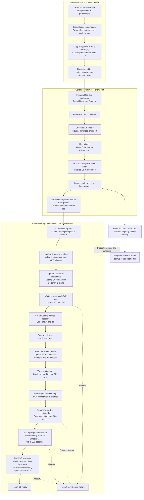

# 001 — acLabs lifecycle

- Status: Draft
- Date: 2026-10-06

## Context

An acLabs environment has two related lifecycles: preparing workspace content and
starting the lab devices. Early editor and terminal access lets users observe
preparation while slower external services and devices are still starting.
Workspace accessibility, workspace preparation, and lab readiness are distinct
conditions. Lab readiness must be based on observed device state.

This document defines the required behavior independently of the tools used to
implement it.

## Decisions

1. The lifecycle consists of workspace preparation, lab preparation, deployment,
   and readiness verification. Completing one phase MUST NOT imply completion of
   the whole lifecycle.

   - **Workspace preparation:** Make the workspace content accurate and usable
     as its required runtime information becomes available. For example, resolve
     environment-dependent content while the user observes progress in the
     terminal. The editor may already be accessible during this phase. Specific
     preparation operations are defined separately.
   - **Lab preparation:** Establish the prerequisites needed to deploy devices.
     For example, verify that the required device image is available, obtain a
     CloudVision onboarding token, and update device startup configurations with
     the token location, streaming endpoint, and lab credentials.
   - **Deployment:** Create and start the devices and connections described by
     the lab topology. For example, start the switch containers, connect their
     interfaces, and apply their prepared startup configurations.
   - **Readiness verification:** Observe whether the deployed lab can be used.
     For example, confirm authenticated SSH access to every topology device and,
     for a CloudVision-integrated lab, confirm that at least one matching device
     reports active streaming before declaring the lab ready.

   See [001 — acLabs lifecycle improvement](../todo/001%20-%20acLabs%20Lifecycle%20Improvement.md)
   for proposed changes to align the current workflow with these phases.

2. The editor and progress terminal MAY become available before workspace
   preparation completes. Preparation status MUST be visible, and content awaiting
   preparation MUST NOT be presented as ready for use.

3. Slow external-service waits and device deployment MUST NOT block editor
   availability. The following conditions MUST be communicated separately:

   - **Workspace accessible:** The editor and progress terminal are available.
   - **Workspace prepared:** The applicable workspace preparation operations have
     completed.
   - **Lab ready:** Deployment and all applicable readiness checks have succeeded.

   Individual preparation operations SHOULD complete when their own prerequisites
   are satisfied. Local operations SHOULD NOT wait for unrelated external
   services, and usable content SHOULD NOT be hidden behind a global preparation
   gate.

4. Lab preparation MUST establish deployment prerequisites and, where applicable,
   CloudVision onboarding data and device configuration before deploying devices.
   Deployment MUST use the lab's declared topology.

5. Readiness verification MUST confirm that all topology devices accept
   authenticated SSH. Labs integrated with on-prem CloudVision MUST additionally
   confirm that at least one topology device is actively streaming to CloudVision.
   Not every device is required to stream.

6. The initial streaming identity is the device hostname. An active CloudVision
   inventory entry satisfies the check only when its hostname matches a node in
   the lab topology. An unrelated active device, successful API login, generated
   token, open port, or running telemetry process alone MUST NOT satisfy readiness.

7. Failed requests, malformed responses, and expired credentials MUST NOT produce
   a ready outcome. Required waits MUST have bounded deadlines and report failure
   when they cannot complete.

8. `READY` means all applicable checks succeeded for the current startup attempt.
   It does not imply continuous health monitoring. Labs without CloudVision
   integration MAY become ready after their other applicable checks succeed.

## Progress states

| State | Meaning |
| --- | --- |
| `READY` | All applicable startup checks succeeded |
| `FAILED` | A required operation failed or exceeded its deadline |

These states describe lab startup. Workspace availability and completion of an
individual preparation operation MUST NOT be reported as whole-lab `READY`.

**TODO:** Review and define intermediate progress states later. The current
implementation's intermediate state names are not prescribed by this specification.

The diagram below shows **only the current setup**, as reviewed on 2026-10-06,
for an on-prem CVP lab with an IPv4 `CVURL`. It is a descriptive snapshot, **not
the final target architecture**. Implementation details and timings shown here do
not define additional lifecycle requirements or progress states.

CVP itself is external to this flow; provisioning waits for its API. Onboarding
and inventory polling share one authenticated client. Startup exits early if
another controller owns the lock, or a previous completion marker exists without
`--force`. Other handled preparation/API errors also report provisioning failure.
The entrypoint uses `set +e`, so many shell failures can continue until a later
check catches them.

## Practical presentation options

The following are implementation options, rather than additional required stages:

- Show a preparation notice in the editor or progress terminal, identifying which
  operations remain pending and updating it when preparation completes.
- Mark content awaiting preparation visibly as pending.
- Refresh displayed content after preparation updates it.
